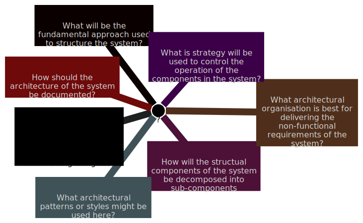

# Architectural Design

    Course Code: ELEE1149 
    
    Course Name: Software Engineering

    Credits: 15

    Module Leader: Seb Blair BEng(H) PGCAP MIET MIHEEM FHEA

---

## Topics Covered

- Architectural design decisions

- Architectural views

- Question: What is a system architecture for a software product?

---

## Architectural design

- Architectural design is concerned with understanding how a software system should be organised and designing the overall structure of that system.

- Architectural design is the critical link between design and requirements engineering, as it identifies the main structural components in a system and the relationships between them. 

- The output of the architectural design process is an architectural model that describes how the system is organised as a set of communicating components. 

---

## Agility and architecture

- It is generally accepted that an early stage of agile processes is to design an overall systems architecture.

- Refactoring the system architecture is usually expensive because it affects so many components in the system

---

## The architecture of a packing robot control system

- In the slide that follows, the architecture for a packaging robot system is presented.
  - The robot can pick up different kinds of objects
  - It uses a vision component to pick out objects on a conveyor, identify the type of object and select the right type of packaging
  - The system then moves objects from the delivery conveyor to be packaged
  - It places packaged objects to another conveyor

- The diagram presented is a block diagram
  - Each box in the diagram represents a component. Boxes within boxes indicate that the component has been decomposed into sub-components.
  - Arrows mean that data and/or signals are passed from component to component in the direction of the arrows

---

## The architecture of a packing robot control system

---

## Advantages of designing a software architecture

Question: What are the benefits of creating a software architecture?

- Stakeholder communication
  - The architecture is a high-level presentation of the system and may be used as a focus of discussion by system stakeholders.

- System analysis
  - Means that analysis of whether the system can meet its non-functional requirements is possible.
- Large-scale reuse
  - The architecture may be reusable across a range of systems as the system architecture is often the same for systems with similar requirements.
  - Product-line architectures may be developed where the same architecture is reused across a range of related systems.

---

## Architectural representations

- Simple, informal block diagrams showing entities and relationships are the most frequently used method for documenting software architectures like in the case of the packing robot.

- But these have been criticized because:
  - They lack semantics, do not show the types of relationships between entities nor the visible properties of entities in the architecture.
  - Very abstract - they do not show the nature of component relationships nor the externally visible properties of the sub-systems.

---

## Architectural design decisions

 - Architectural design is a creative process, so the process differs depending on the type of system being developed.

- However, several common decisions span all design processes, and these decisions affect the non-functional characteristics of the system.

- However, useful for communication with stakeholders and for project planning – for managers to start assigning different task to team members.

---
## Architectural design decisions

<!--
mindmap
    root((?))
        A[Is there a generic application architecture that can act as a a termplate for the system that is being designed?]
        B[What will be the fundamental approach used to structure the system?]
        C[How will the structual components of the system be decomposed into sub-components]
        G[What architectural patterns or styles might be used here?]
        D[What architectural organisation is best for delivering the non-functional requirements of the system?]
        E[How should the architecture of the system be documented?]
        F[What is strategy will be used to control the operation of the components in the system?]
       
-->
---

## Architecture reuse

- Systems in the same domain often have similar architectures that reflect domain concepts.

- Application product lines are built around a core architecture with variants that satisfy customer requirements.

- The architecture of a system may be designed around one of more architectural patterns or styles. 
  - These capture the essence of an architecture and can be instantiated in different ways.

---

## Architecture and system characteristics

- **Performance**
  - Localize critical operations and minimize communications. Use large rather than fine-grain components.

- **Security**
  - Use a layered architecture with critical assets in the inner layers.

- **Safety**
  - Localize safety-critical features in a small number of sub-systems.

- **Availability**
  - Include redundant components and mechanisms for fault tolerance.

- **Maintainability**
  - Use fine-grain, replaceable components.

---

## Architectural views

- What views or perspectives are useful when designing and documenting a system’s architecture?

- What notations should be used for describing architectural models?

- Each architectural model only shows one view or perspective of the system. 

- It might show how a system is decomposed into modules, how the run-time processes interact or the different ways in which system components are distributed across a network. For both design and documentation, you usually need to present multiple views of the software architecture. 

---

## Architectural views

---

## 4+1 view model of software architecture

- A **logical view**, which shows the key abstractions in the system as objects or object classes. 

- A **process view**, which shows how, at run-time, the system is composed of interacting processes. 

- A **development view**, which shows how the software is decomposed for development.

- A **physical view**, which shows the system hardware and how software components are distributed across the processors in the system.

- Related using use cases or scenarios (+1) 
