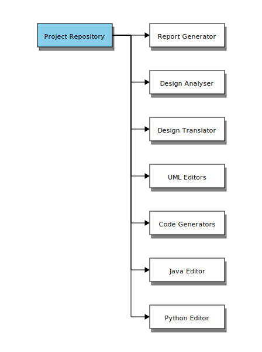
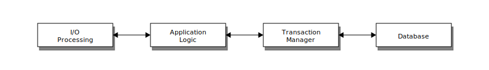

# Architectural Patterns

    Course Code: ELEE1149 
    
    Course Name: Software Engineering

    Credits: 15

    Module Leader: Seb Blair BEng(H) PGCAP MIET MIHEEM FHEA

---

## Architectural patterns

- Patterns are a means of representing, sharing and reusing knowledge.

- An architectural pattern is a stylized description of good design practice, which has been tried and tested in different environments.

- Patterns should include information about when they are and when they are not useful.

- Patterns may be represented using tabular and graphical descriptions.

---

## Layered architecture

- Used to model the interfacing of sub-systems.

- Organises the system into a set of layers (or abstract machines) each of which provide a set of services.

- Supports the incremental development of sub-systems in different layers. When a layer interface changes, only the adjacent layer is affected.

- However, often artificial to structure systems in this way.

---

## The Layered architecture pattern 

|Name|Layered Architecture|
|----|----|
|Description| Organises the system into layers with related functionality associated with each layer. A layer provides services to the layer above it so the lowest-level layers represent core services that are likely to be used throughout the system.|
|Example|A layered model of a digital learning environment iLearn, as shown in the figure on slide 10.|
|When used|Used when building new facilities on top of existing systems; when the development is spread across several teams with each team responsibility for a layer of functionality; when there is a requirement for multi-level security.|
|Advantages|Allows replacement of entire layers so long as the interface is maintained. Redundant facilities (e.g., authentication) can be provided in each layer to increase the dependability of the system.|
|Disadvantages|In practice, providing a clean separation between layers is often difficult and a high-level layer may have to interact directly with lower-level layers rather than through the layer immediately below it. Performance can be a problem because of multiple levels of interpretation of a service request as it is processed at each layer.|

---

## A generic layered architecture 

---

## iLearn: A digital learning environment

- A digital learning environment is a framework in which a set of general-purpose and specially designed tools for learning may be embedded plus a set of applications that are geared to the needs of the learners using the system. 

- The tools included in each version of the environment are chosen by teachers and learners to suit their specific needs. 
  - These can be general applications such as spreadsheets, learning management applications such as a Virtual Learning Environment (VLE) to manage homework submission and assessment, games and simulations. 

---

## Repository architecture

- Sub-systems must exchange data. This may be done in two ways:
  - Shared data is held in a central database or repository and may be accessed by all sub-systems;
  - Each sub-system maintains its own database and passes data explicitly to other sub-systems.
- When large amounts of data are to be shared, the *repository model* of sharing is most commonly used as this is an efficient data sharing mechanism.

---

## The Repository pattern 

|Name|Repository|
|---|---|
|Description|All data in a system is managed in a central repository that is accessible to all system components. Components do not interact directly, only through the repository.|
|Example|The figure on the next slide is an example of an IDE where the components use a repository of system design information. Each software tool generates information which is then available for use by other tools.|
|When used|You should use this pattern when you have a system in which large volumes of information are generated that has to be stored for a long time. You may also use it in data-driven systems where the inclusion of data in the repository triggers an action or tool.|
|Advantages|Components can be independent—they do not need to know of the existence of other components. Changes made by one component can be propagated to all components. All data can be managed consistently (e.g., backups done at the same time) as it is all in one place. |
|Disadvantages|The repository is a single point of failure so problems in the repository affect the whole system. May be inefficiencies in organizing all communication through the repository. Distributing the repository across several computers may be difficult.|

---

## A repository architecture for an IDE 

---

## Client-server architecture

- Distributed system model which shows how data and processing is distributed across a range of components.
  - Can be implemented on a single computer.

- Set of stand-alone servers which provide specific services such as printing, data management, etc.

- Set of clients which call on these services.

- Network which allows clients to access servers.

---

## The Client–server pattern 

|Name|Client-server|
|---|---|
|Description|In a client–server architecture, the functionality of the system is organized into services, with each service delivered from a separate server. Clients are users of these services and access servers to make use of them.|
|Example|The figure on the next slide is an example of a film and video/DVD library organized as a client–server system.|
|When used|Used when data in a shared database has to be accessed from a range of locations. Because servers can be replicated, may also be used when the load on a system is variable.|
|Advantages|The principal advantage of this model is that servers can be distributed across a network. General functionality (e.g., a printing service) can be available to all clients and does not need to be implemented by all services.|
|Disadvantages|Each service is a single point of failure so susceptible to denial of service attacks or server failure. Performance may be unpredictable because it depends on the network as well as the system. May be management problems if servers are owned by different organizations.|

---

## A client–server architecture for a film library 

---

## Application architectures

- Application systems are designed to meet an organisational need.

- As businesses have much in common – they need to hire people, issues invoices, keep accounts, etc., their application systems also tend to have a common architecture that reflects the application requirements.

- A *generic application architecture* is an architecture for a type of software system that may be configured and adapted to create a system that meets specific requirements.

---

## Use of application architectures

- As a starting point for architectural design
  - base your initial design on a generic application architecture and then specialise it for the specific system.

- As a design checklist
  - If you have developed an architectural design for a specific system, you can compare this with the generic application architecture and check that your design is consistent with it.

- As a way of organising the work of the development team
  - You can assign to group members to implement different components within the architecture.

- As a means of assessing components for reuse.

- As a vocabulary for talking about application types.

---

## Examples of application types
- **Data processing applications**
  - Data driven applications that process data in batches without explicit user intervention during the processing.

- **Transaction processing applications**
  - Data-centered applications that process user requests and update information in a system database. 

- **Event processing systems**
  - Applications where system actions depend on interpreting events from the system’s environment.

- **Language processing systems**
  - Applications where the users’ intentions are specified in a formal language, such as a programming language, that is processed and interpreted.

---

## Application type examples

- Two very widely used generic application architectures are *transaction processing systems* and *language processing systems*.

- **Transaction processing systems**
  - E-commerce systems;
  - Reservation systems.

- **Language processing systems**
  - Compilers;
  - Command interpreters.

---

## Transaction processing systems

- Process user requests for information from a database or requests to update the database.

- A database transaction is part of a sequence of operations, and it is treated as a single unit 

- From a user perspective a transaction is:
  - Any coherent sequence of operations that satisfies a goal;
  - For example - find the times of flights from London to Paris.

- Users make asynchronous requests for service which are then processed by a transaction manager.

- Transaction processing systems may be organized as a “pipe and filter” architecture, with system components responsible for input, processing and output. 

---

## The structure of transaction processing applications 

---

## The software architecture of an ATM system 

---

## Information systems architecture

- An information system allows controlled access to a large base of information, such as a library catalog, a flight timetable, or the records of patients in a hospital. They are almost always web-based systems.

- These are transaction-based systems as interaction with these systems generally involves database transactions.

- Information systems have a generic architecture that can be organized as a layered architecture. Layers include:
  - The user interface
  - User communications
  - Information retrieval
  - System database

---

## Layered information system architecture 

---

## Web-based information systems

- Information and resource management systems are now usually web-based systems where the user interfaces are implemented using a web browser. 

- For example, e-commerce systems are Internet-based resource management systems that accept electronic orders for goods or services and then arrange delivery of these goods or services to the customer. 

- In an e-commerce system, the application-specific layer includes additional functionality supporting a ‘shopping cart’ in which users can place a number of items in separate transactions, then pay for them all together in a single transaction.

---

## Language processing systems

- Accept a natural or artificial language as input and generate some other representation of that language. For programming languages, may also execute the resulting code. 

- *Compilers* translate a programming language into machine code. 

- *Natural language processing systems* may translate one natural language to another, e.g. English to Bulgarian

- Used in situations where the easiest way to solve a problem is to describe an algorithm or describe the system data

---

## The architecture of a language processing system 

---

## Compiler components

- A **lexical analyzer**, which takes input language tokens and converts them to an internal form.

- A **symbol table**, which holds information about the names of entities (variables, class names, object names, etc.) used in the text that is being translated.

- A **syntax analyzer**, which checks the syntax of the language being translated. 

- A **syntax tree**, which is an internal structure representing the program being compiled.

- A **semantic analyzer** that uses information from the syntax tree and the symbol table to check the semantic correctness of the input language text. 

- A **code generator** that ‘walks’ the syntax tree and generates abstract machine code.