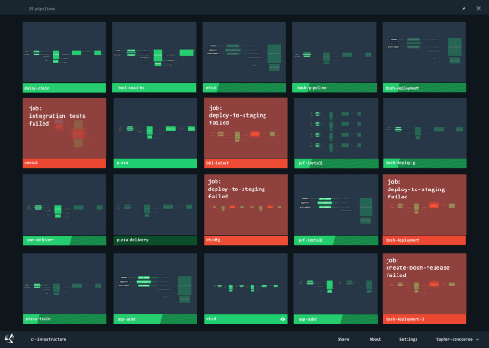

# Continuous Integration and Continuous Deployment

    Course Code: ELEE1149 
    
    Course Name: Software Engineering

    Credits: 15

    Module Leader: Seb Blair BEng(H) PGCAP MIET MIHEEM FHEA

---

## Software Build Technology and CI/CD

- What do we mean by a Build?
  - Assemble the correct source code depending on 
    - Hardware
    - Operating System
    - Application Requirements 
  - Compile
  - Perform tests and QA on source code and binary code
  - Package source code and binary code for different production systems
  - Create documentation

---

## Build Automation

- Build automation is the act of scripting or automating a wide variety of tasks that software developers do in their day-to-day activities to achieve the build process.

- This is one of the important practices used in agile projects

- Automation is not an option, it is a requirement 

---

## Advantages of Build Automation

- Improve development process; product quality and reduce the cost of QA
  - Accelerate the compile and link processing
  - Eliminate redundant tasks 
  - Minimise “Bad Builds” (if regression tests fail, automatic reporting will let you know, you can revert t an earlier build)
  - Eliminate dependencies on key personnel 
  - Have history of builds and releases in order to investigate issues
  - Save time and money

- Support the role of the installer who is not the user or developer, also has no IDE to use. Think organisation IT Support.

---

## Types of Build Automation

- On-demand automation such as a user running a script at the command line

- Scheduled automation such as a continuous integration server running a nightly build

- Triggered automation such as a continuous integration server running a build on every commit to a version control system

---

## Continuous Integration

- This is a development practice that calls upon development teams to ensure that a build and subsequent testing is conducted for every code change made to a software program.

- Continuous integration was first introduced in the year 2001 with the software known as **Cruise Control**

- Continuous Integration has become a key practice in any software organisation

---

## Continuous Integration

- First, a developer commits the code to the version control repository. 

- Meanwhile, the Continuous Integration server on the integration build machine polls the source code repository for changes (e.g., every few minutes). 

- Soon after a commit occurs, the Continuous Integration server detects that changes have occurred in the version control repository 

- The Continuous Integration server retrieves the latest copy of the code from the repository and then executes a build script, which integrates the software

---

## Continuous Integration

- The Continuous Integration server generates feedback by e-mailing build results to the specified project members.

- Unit tests are then carried out if the build of that project passes. If the tests are successful, the code is ready to be deployed to either the staging or production server.

- Th e Continuous Integration server continues to poll for changes in the version control repository and the whole process repeats.

---

## CI/CD

- Continuous Integration:
  - “Developers practicing continuous integration merge their changes back to the main branch as often as possible. The developer's changes are validated by creating a build and running automated tests against the build. By doing so, you avoid the integration hell that usually happens when people wait for release day to merge their changes into the release branch.”
  - 
- Continuous Deployment:
  - “…every change that passes all stages of your production pipeline is released to your customers. There's no human intervention, and only a failed test will prevent a new change to be deployed to production.”

---

## CI/CD Pipelines

- Modern CI and CD practices are referred to as a CI/CD pipeline and can handle every stage of the build process from commit to deployment.

---

## CI/CD Pipelines

---

## CI/CD Tools

- Apache Ant
- Azure Pipelines
- Chef
- Github Actions
- Gradle
- Jenkins
- Maven
- Octopus Deploy
- Travis CI
- TeamCity

