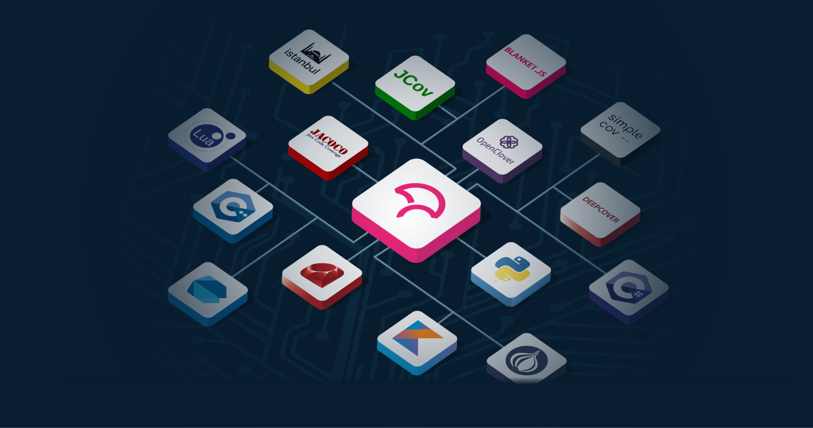

# Continuous Integration and Continuous Deployment

    Module Code: ELEE1149 
    
    Module Name: Software Engineering

    Credits: 15

    Module Leader: Seb Blair BEng(H) PGCAP MIET MIHEEM FHEA

<!-- _footer: "[Download as a PDF](https://github.com/UniOfGreenwich/ELEE1149-Lectures/raw/gh-pages/content/cicd/cicd.pdf)" -->


---

## Software Build Technology and CI/CD

- What do we mean by a Build?
  - Assemble the correct source code depending on 
    - Hardware
    - Operating System
    - Application Requirements 
  - Compile
  - Perform tests and QA on source code and binary code
  - Package source code and binary code for different production systems
  - Create documentation

---

## Build Automation

- Build automation is the act of scripting or automating a wide variety of tasks that software developers do in their day-to-day activities to achieve the build process.

- This is one of the important practices used in agile projects

- Automation is not an option, it is a requirement 

---

## Advantages of Build Automation

- Improve development process; product quality and reduce the cost of QA
  - Accelerate the compile and link processing
  - Eliminate redundant tasks 
  - Minimise “Bad Builds” (if regression tests fail, automatic reporting will let you know, you can revert t an earlier build)
  - Eliminate dependencies on key personnel 
  - Have history of builds and releases in order to investigate issues
  - Save time and money

- Support the role of the installer who is not the user or developer, also has no IDE to use. Think organisation IT Support.

---

## Types of Build Automation

- On-demand automation such as a user running a script at the command line

- Scheduled automation such as a continuous integration server running a nightly build

- Triggered automation such as a continuous integration server running a build on every commit to a version control system

---

## Continuous Integration

- This is a development practice that calls upon development teams to ensure that a build and subsequent testing is conducted for every code change made to a software program.

- Continuous integration was first introduced in the year 2001 with the software known as **Cruise Control**

- Continuous Integration has become a key practice in any software organisation

---

## Continuous Integration

- First, a developer commits the code to the version control repository. 

- Meanwhile, the Continuous Integration server on the integration build machine polls the source code repository for changes (e.g., every few minutes). 

- Soon after a commit occurs, the Continuous Integration server detects that changes have occurred in the version control repository 

- The Continuous Integration server retrieves the latest copy of the code from the repository and then executes a build script, which integrates the software

---

## Continuous Integration

- The Continuous Integration server generates feedback by e-mailing build results to the specified project members.

- Unit tests are then carried out if the build of that project passes. If the tests are successful, the code is ready to be deployed to either the staging or production server.

- Th e Continuous Integration server continues to poll for changes in the version control repository and the whole process repeats.

---

## CI/CD

- Continuous Integration:
  - “Developers practicing continuous integration merge their changes back to the main branch as often as possible. The developer's changes are validated by creating a build and running automated tests against the build. By doing so, you avoid the integration hell that usually happens when people wait for release day to merge their changes into the release branch.”
  - 
- Continuous Deployment:
  - “…every change that passes all stages of your production pipeline is released to your customers. There's no human intervention, and only a failed test will prevent a new change to be deployed to production.”

---

## CI/CD Pipelines

- Modern CI and CD practices are referred to as a CI/CD pipeline and can handle every stage of the build process from commit to deployment.


---

## CI/CD Pipelines


---

## CI/CD Tools

- Apache Ant
- Azure Pipelines
- Chef
- Github Actions
- Gradle
- Jenkins
- Maven
- Octopus Deploy
- Travis CI
- TeamCity

---

## How GitHub Actions Work

<table style="width:100%; font-size:25px"">
<tr>
<td style="width:60%" >

1. **Triggers**: Define events to start workflows (e.g., `push`, `pull_request`, `schedule`).
2. **Workflow**: A collection of jobs defined in a YAML file.
3. **Jobs**: Independent units, each with multiple steps.
4. **Actions**: Individual tasks in a workflow.

</td>

<td>

```yaml
on:
  push:
    branches:
      - main
jobs:
  build:
    runs-on: ubuntu-latest
    steps:
      - name: Checkout code
        uses: actions/checkout@v3
      - name: Set up Node.js
        uses: actions/setup-node@v3
        with:
          node-version: '16'
      - name: Install dependencies
        run: npm install
      - name: Run tests
        run: npm test
```

</td>
</tr>
</table>


---

## Benefits of GitHub Actions

- **Automation**:
  - Automated builds, tests, and deployments.
- **Scalability**:
  - Run workflows in parallel.
- **Integration**:
  - Connect with cloud providers, databases, and third-party tools.
- **Community Support**:
  - Use and contribute to the GitHub Marketplace.

---

## Setting Up GitHub Actions

1. **Create a `.github/workflows` folder**:
   - Store workflow YAML files here.
2. **Define a Workflow**:
   - Specify triggers, jobs, and steps.
3. **Use Marketplace Actions**:
   - Pre-built solutions for common tasks.

---

## Example: Deploying a Static Website

<div style="font-size:22px">

```yaml
name: Deploy Website

on:
  push:
    branches:
      - main

jobs:
  deploy:
    runs-on: ubuntu-latest
    steps:
      - name: Checkout code
        uses: actions/checkout@v3
      - name: Build website
        run: |
          npm install
          npm run build
      - name: Deploy to GitHub Pages
        uses: peaceiris/actions-gh-pages@v3
        with:
          github_token: ${{ secrets.GITHUB_TOKEN }}
          publish_dir: ./dist
```

</div>

---

## Debugging Workflows

- **Workflow Logs**:
  - Access logs via the Actions tab.
- **Enable Debugging**:
  - Use `ACTIONS_STEP_DEBUG` for detailed logs.
- **Common Issues**:
  - Missing secrets or tokens.
  - Incorrect syntax in YAML files.

---

## Code Coverage

- Code coverage is a metric used to measure the effectiveness of software testing. It refers to the percentage of code lines or functions that are executed by automated tests. 

- By measuring code coverage, developers can identify areas of code that are not covered by tests, and ensure that their tests are comprehensive and effective. A high code coverage percentage indicates that most of the code has been tested and any defects are likely to be caught early. 

- Code coverage is an important aspect of software testing and is often used in conjunction with other testing techniques. Want to know more about: Testing code coverage

---

## A Program & its Control Flow Graph

```py
s0: z = input()
s1: x = input()
s2: if x > 5:
s3:   y = x * 5
    else
s4:   y = z / 5
s5: print(y)
s6: return
```

- Each node is a statement

- Each solid edge is control flow edge between two statements


---

## Node and Edge Coverage*

- **Node (Statement) Coverage**
  - Fraction of graph nodes covered by tests
  - Testing Goal: Every node should executed at least once

- **(Control Flow) Edge Coverage**
  - Fraction of graph edges covered by tests
  - Testing Goal: Every edge should executed at least once

---

## (Control Flow) Path Coverage*

- **Path** is a sequence of nodes in a graph such that consecutive ndoes in the path are connected by a edge in the graph
- **(Control Flow) Path Coverage**
  - Fraction of graph paths convered by tests
  - How can we deal with program loops, i.e graphs with infinite number of paths?


---

## (Control Flow) Path Coverage*

- **(Control Flow) Path Coverage - Testing Goal**
  - Every path between every pai of nodes should be executed (*may lead to redunancy*)
  - Every path between source and sinks should be executed.
    - Ideal for programs without loops
  - Sufficient number of paths between source and sink nodes are executed such that all edges are executed
  - Every finite path between source and sinks should be executed such that each loops is executed at least once (*when all paths are considered*)
    - Good enough for programs with loops

---

## (Control Flow) Path Coverage*

- **(Control Flow) Path Coverage**
  - What about programs without sinks?
  - Every finite path between source and every node is excuted with each loop executed at least once (*when all paths are considered*)
  - What about infeasible paths?


---

## A Program & its Data Flow Graph

```py
s0: z = input()
s1: x = input()
s2: if x > 5:
s3:   y = x * 5
    else
s4:   y = z / 5
s5: print(y)
s6: return
```

- Each node is a statement

- Each solid edge is control flow edge between two statements

- Each dashed edge is the data flow between two statements (from definition of a variable to its use)


---

## Data Flow Coverage*

- Fraction of def-use edges covered by tests
- Testing Goal: Every def-use edge should be executed at least once

<div style="padding-top:50px">

</div>

- How well will this work in case of programs with pointers and references?
- Can we detect all def-use edges?
- What about infeasible def-use edges?
- What about in case of programs written in OOP?

---

## Which is better?


<!--

1. With 2 (red) paths we get 100% node and edge covereage, but miss exercising s2-s6 data flow edge?

2. With 2 (red) paths we get 100% node and edge covereage, but miss exercising s3-s6 data flow edge?

3. With 2 (red) paths we get 100% data flow coverage (s2-s6 and s3-s6) but miss exercising s5 node

4. With 2 (red) paths we get 100% node, edge covereage, and data flow coverage, but with some redunancy

5. With 3 (red) paths we get 100% node, edge covereage, and data flow coverage, but with lesser redunancy

-->

---

## Branch Coverage*

- Fractio of branches (edges) covered by tests
- Testing Goal: Every branch should be executed at least once

---

## Condition Coverage*

<div style="font-size:22px">

- Fraction of boolean expression valuations covered by tests
- Testing Goal:
  - Every simple boolean expression should be evaulated to both true and false
  - Every compound boolean expression should be evaulated to both true and false

</div>


---

## Coverage Tools



---

## Coverage Tools - Python 


- [Coverage.py](https://coverage.readthedocs.io/en/v4.5.x/): A free tool for monitoring the coverage of your Python apps, monitoring every bit of your code to find what was executed and what was not.

- [pytest-cov](https://pypi.org/project/pytest-cov/): A free language plug-in to produce a coverage report of your app.

- [PyCharm’s integrated coverage tool](https://www.jetbrains.com/help/pycharm/code-coverage.html): With the professional version of the PyCharm IDE, you have built-in support for performing coverage checks on your code with low runtime overhead. The tool runs $199 per year for every user.

--- 

## Coverage Tools - JavaScript 


- [Istanbul](https://istanbul.js.org/): The most famous JS tool for code coverage. Supporting unit tests, server-side functional tests, and browser tests. And it’s all for free!

- [Blanket](https://github.com/alex-seville/blanket): A simple, free-to-use JS library designed for both the web and the server-side of JavaScript.

- [jscoverage](https://www.npmjs.com/package/jscoverage): Written purely in JavaScript, this free tool is an ideal companion for verifying code coverage both on the browser and server-side of your application.
  
---

## Coverage Tools - Rust

- [Tarpaulin](https://github.com/xd009642/tarpaulin): A free Rust library providing source code line coverage functionalities. The product is still in an early stage of development, yet it’s already proving a good choice for testing Rust applications.

- [grcov](https://github.com/mozilla/grcov): A free library collecting and aggregating code coverage information for all the Rust files in your project.

- [kcov](https://github.com/SimonKagstrom/kcov): A free BSD/Linux/OS X code coverage tester for compiled languages, as well as Python and Bash.


