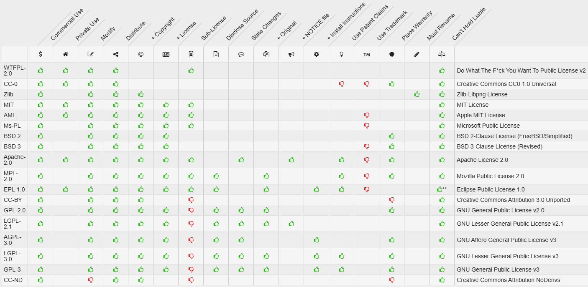
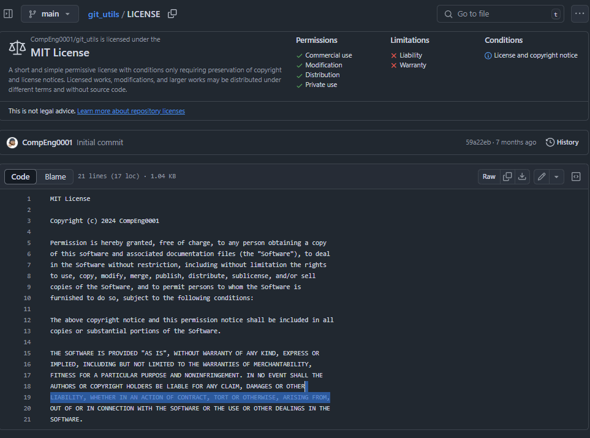
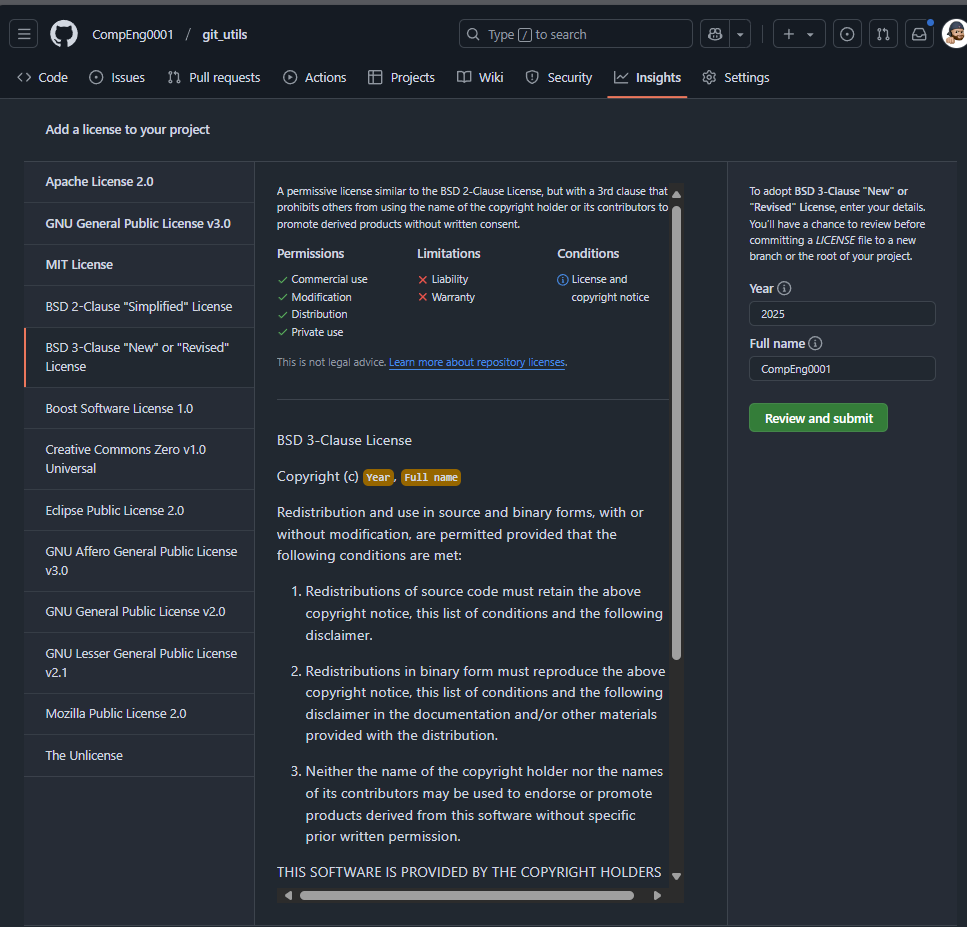

<!-- _footer: "[Download as a PDF](https://github.com/UniOfGreenwich/ELEE1149-Lectures/raw/gh-pages/content/Implmentation/Implementation.pdf)" -->

# Implementation

    Module Code: ELEE1149 
    
    Module Name: Software Engineering

    Credits: 15

    Module Leader: Seb Blair BEng(H) PGCAP MIET MIHEEM FHEA

---

## Implementation issues

- Focus here is not on programming, although this is obviously important, but on other implementation issues that are often not covered in programming texts:
  - **Reuse** Most modern software is constructed by reusing existing components or systems. When you are developing software, you should make as much use as possible of existing code.
  - **Configuration management** During the development process, you have to keep track of the many different versions of each software component in a configuration management system.
  - **Host-target development** Production software does not usually execute on the same computer as the software development environment. Rather, you develop it on one computer (the host system) and execute it on a separate computer (the target system).

---

## Reuse

- From the 1960s to the 1990s, most new software was developed from scratch, by writing all code in a high-level programming language. 
   - The only significant reuse of software was the reuse of functions and objects in programming language libraries. 

- Costs and schedule pressure mean that this approach became increasingly unviable, especially for commercial and Internet-based systems. 

- An approach to development based around the reuse of existing software emerged and is now generally used for business and scientific software. 

---
## Reuse levels

- **The abstraction level**
  - At this level, you don’t reuse software directly but use knowledge of successful abstractions in the design of your software. 

- **The object level**
  - At this level, you directly reuse objects from a library rather than writing the code yourself. 

- **The component level**
  - Components are collections of objects and object classes that you reuse in application systems. 

- **The system level**
  - At this level, you reuse entire application systems. 

---

## Software Reuse

---

## Reuse costs

- The costs of the time spent in looking for software to reuse and assessing whether or not it meets your needs. 

- Where applicable, the costs of buying the reusable software. For large off-the-shelf systems, these costs can be very high.

- The costs of adapting and configuring the reusable software components or systems to reflect the requirements of the system that you are developing.

- The costs of integrating reusable software elements with each other (if you are using software from different sources) and with the new code that you have developed. 

---

## Configuration management

- Configuration management is the name given to the general process of managing a changing software system. 

- The aim of configuration management is to support the system integration process so that all developers can access the project code and documents in a controlled way, find out what changes have been made, and compile and link components to create a system.

---

## Configuration management activities

- **Version management**, where support is provided to keep track of the different versions of software components. Version management systems include facilities to coordinate development by several programmers. 

- **System integration**, where support is provided to help developers define what versions of components are used to create each version of a system. This description is then used to build a system automatically by compiling and linking the required components.

- **Problem tracking**, where support is provided to allow users to report bugs and other problems, and to allow all developers to see who is working on these problems and when they are fixed. 

---

## FOSS vs FLOSS

Reuse; legal and goodwill

- **FOSS**, or “Free and Open Source Software”, focuses on the practical benefits of collaboration and openness. By framing software freedom in terms of operational advantages, FOSS appeals to businesses and governments prioritising innovation and efficiency.

- **FLOSS**, standing for “Free/Libre and Open Source Software” possesses the term “Libre” to clarify that “free” refers to freedom, not cost. This distinction aligns FLOSS with a broader vision of inclusivity, ethics, and empowerment.

-----

## FOSS vs FLOSS

<table style="font-size:24px">
<tr>
<td>
Aspect
</td>
<td>
FOSS
</td>
<td>
FLOSS
</td>
</tr>
<tr>
<td>
Legal differences
</td>
<td>
<li> Emphasises open source licenses like MIT, GPL, and Apache, which grant freedom to use, modify, and distribute software. 

<li> Focuses on compliance with specific open source licensing requirements. 

<li>Legal discussions often frame “freedom” in terms of user rights under open source licensing.
</td>
<td>
<li>Includes the same legal principles as FOSS but with a stronger emphasis on “Libre” to highlight freedom from proprietary restrictions.

<li>More explicit in communicating the ethical values behind these rights, especially in regions or systems with a history of restrictive IP practices.

<li>Advocates for ensuring software freedom as a legal norm in addition to license compliance
</td>
</tr>
</table>

----

## FOSS vs FLOSS

<table style="font-size:24px">
<tr>
<td>
Aspect
</td>
<td>
FOSS
</td>
<td>
FLOSS
</td>
</tr>
<tr>
<td>
Technical differences
</td>
<td>
<li> Focuses on technical collaboration through accessible source code. 

<li> Prioritises practical benefits such as software quality, efficiency, and innovation enabled by open development. 

</td>
<td>
<li>Includes the same technical benefits as FOSS but extends the scope to advocate for greater inclusivity in development.

<li>Emphasises removing barriers to access, particularly in underrepresented regions and communities.

</td>
</tr>
</table>

---

## FOSS vs FLOSS

<table style="font-size:24px">
<tr>
<td>
Aspect
</td>
<td>
FOSS
</td>
<td>
FLOSS
</td>
</tr>
<tr>
<td>
Public policy differences	
</td>
<td>
<li> Typically associated with pragmatic policies that promote economic benefits of open source, such as reducing costs in government IT procurement. 

<li> Appeals to governments and organisations focused on innovation and collaboration without strong ethical framing.

<li>Often aligns with digital economy initiatives and tech-sector growth strategies.

</td>
<td>
<li>Advocates for policies explicitly embedding the principle of digital freedom, beyond economic efficiency.

<li>Promotes access to technology as a right, particularly for underserved communities, aligning with broader social justice and human rights initiatives.

<li>More appealing to policymakers in regions where inclusivity and access to information are central goals.
</td>
</tr>
</table>

---

## Open source development

- **Open source development** is an approach to software development in which the source code of a software system is published and volunteers are invited to participate in the development process

- Its roots are in the **Free Software Foundation** (www.fsf.org), which advocates that source code should not be proprietary but rather should always be available for users to examine and modify as they wish. 

- Open source software extended this idea by using the Internet to recruit a much larger population of volunteer developers. Many of them are also users of the code.

---

## Open source systems

- The best-known open source product is, of course, the Linux operating system which is widely used as a server system and, increasingly, as a desktop environment.

- Other important open source products are Java, the Apache web server and the mySQL database management system. 

--- 

## Open source issues

- Should the product that is being developed make use of open source components?

- Should an open source approach be used for the software’s development?

**Questions:**
- If you are a software developer would you offer your programs as open source? Why or why not?
- If the software is open source where will your profits come from?
- What are the benefits of open source software development for the developers themselves?

--- 

## Open source business

- More and more product companies are using an open source approach to development. 

- Their business model is not reliant on selling a software product but on selling support for that product. 

- They believe that involving the open source community will allow software to be developed more cheaply, more quickly and will create a community of users for the software. 

---

## Open source licensing

- A fundamental principle of open-source development is that source code should be freely available, this does not mean that anyone can do as they wish with that code.
  
  - Legally, the developer of the code (either a company or an individual) still owns the code. They can place restrictions on how it is used by including legally binding conditions in an open source software license. 
  
  - Some open source developers believe that if an open source component is used to develop a new system, then that system should also be open source. 
  
  - Others are willing to allow their code to be used without this restriction. The developed systems may be proprietary and sold as closed source systems (e.g. distributed under a licensing agreement).

----

## Types of Software Licenses

<table style="font-size:22px">

  <tr>
    <th>Public Domain License</th>
    <th>LGPL</th>
    <th>Permissive</th>
    <th>Copyleft</th>
    <th>Proprietary</th>
  </tr>
  <tr>
    <td>Anyone is free to use and modify the software</td>
    <td>You can link to open source libraries within your own software  Resulting code can be licensed under any other type of license</td>
    <td>Few restrictions or requirements for the distribution or modifications to the software</td>
    <td>Restrictive - known as reciprocal licenses</td>
    <td>Most restrictive - Ineligible for copying, modifying, or distribution</td>
  </tr>
</table>

----

## License Table

[https://www.gieson.com/school/license/](https://www.gieson.com/school/license/)

----

## License models

- The GNU General Public License (GPL). This is a so-called ‘reciprocal’ license that means that if you use open source software that is licensed under the GPL license, then you must make that software open source. 

- The GNU Lesser General Public License (LGPL) is a variant of the GPL license where you can write components that link to open source code without having to publish the source of these components. 

- The Berkley Standard Distribution (BSD) License. This is a non-reciprocal license, which means you are not obliged to re-publish any changes or modifications made to open source code. You can include the code in proprietary systems that are sold.

- MIT License: This is a permissive open-source license originating from the Massachusetts Institute of Technology (MIT). This license allows users to freely use, modify, and distribute the software. It is non-reciprocal, meaning you are not required to release the source code of any modifications. The software can be included in proprietary systems that are sold, as long as the original copyright notice and license terms are included in all copies or substantial portions of the software

----

## Examples of FLOSS/FOSS/OSSS 

1. Linux Kernel
     - License: GNU General Public License (GPL) v2

2. Mozilla Firefox
      - License: Mozilla Public License (MPL) 2.0

3. LibreOffice
      - License: Mozilla Public License (MPL) 2.0

4. Apache HTTP Server
      - License: Apache License 2.0

5. Python
      - License: Python Software Foundation License

----

## Licenses with GitHub

- GitHub lets you pick a licence and generates the License file or you can add it yourself manually

