# Interfaces And Dependency Injection

    Course Code: ELEE1149

    Course Name: Software Engineering

    Credits: 15

    Module Leader: Seb Blair BEng(H) PGCAP MIET MIHEEM FHEA

---

## Classes

> **Classes** are software programming models - abstractions of the real world or system entities. 

- Classes have *state* and *behaviour*

- *Variables* are used to describe the state of the class and methods are used to describe behaviour

- Classes are collections of objects with common structure, common behaviour, common relationships and common semantics

- Objects belong to a particular class, objects are instances of a particular class 

---

## Classes & Objects (2)

- **Class**
  - a template that describes the data and behaviour associated with instances of that class
  - the basic building block of an object-oriented language such as C++, C#, Java, Kotlin etc.
  - classes are data types and can be used to create multiple objects

- **Object**
  - represents something with which we can interact with in a program
  - an object’s behaviour defines a collection of services that we can tell it to perform for us
  - a class is abstract and represents a concept, and an object represents an instance (realisation) of a class 

---

## Class - an Example

<div class="grid grid-cols-2 gap-4">
<div>



</div>

<div style="font-size:26px; margin-top:1px ">

```c#
class Module {
 string name;
 string code;
 int year;

 register(){

 }

 unregister(){

 }

}

```

</div>
<div>

---

## Objects


- An Object is an instance of a class and a group of objects for the same class have sepatate memory addresses. 
  
<div align=center>


</div>


---


## Abstraction

- Data abstraction is the process of hiding certain details and showing only essential information to the user.
Abstraction can be achieved with either `abstract` classes or `interfaces` 

- The `abstract` keyword is used for classes and methods:
  - Abstract class: is a restricted class that cannot be used to create objects (to access it, it must be inherited from another class).

  - Abstract method: can only be used in an abstract class, and it does not have a body. The body is provided by the derived class (inherited from).

---


## Inheritance

- Another class can inherit another classes functionality
- All methods, fields, variables, functions etc must be implemented and cannot be modified.
- Class can inherit only one abstract class.
- Optional implementation of abstract class internals.


---
## Example: Inheritance and abstraction 

```c#
abstract class Person
{
    public string Name { get; set; }
    public int Age { get; set; }

    public abstract void DisplayDetails();
}

class Student : Person
{
    public int StudentId { get; set; }

    // function and fields all must be implemented.
    public override void DisplayDetails()
    {
        Console.WriteLine($"Student: {Name}, Age: {Age}, Student ID: {StudentId}");
    }
}
```

---

## Interface

- Interface Class is like a header file in C
- It includes fields (setters,getters) and prototypes
- There is no body to any prototype, this is handled by the implementing class. 
- You still have to include all the "code" in the implementing function, but it does not have to action it. 

---


## Dependency Injection

- DI is a design pattern widely used in C# development for achieving Inversion of Control (IoC).

- In DI, dependencies of a class are provided from the outside, rather than the class creating its own dependencies.


---

## Key Concepts:

<div style="font-size:24px">

- **Inversion of Control (IoC):**

  - In IoC, control over object creation and management is shifted from the class itself to an external entity.

- **Dependency:**

  - A dependency is an object that another object relies on to accomplish its tasks.

- **Injection:**

  - Injection involves providing dependencies to a class from an external source.

- **Types of Dependency Injection in C#:**

   - Constructor Injection
   - Setter Injection
   - Interface Injection

</div>

---

## Example: Interface

<div class="grid grid-cols-2 gap-4">
<div>

```c#
// declare interface
interface IMyInterface {
  // prototypes
  void MyFuncton(int a, int b);
  void AnotherFunction(); 
}

// implement interface
class MyClass : IMyInterface {

  // can add some fuctionality here
  void MyFuction(int a,int b){
      System.out.writeln(a+b);
  }
  
  void AnotherFunction(){
    // Not inuse.
  }
}

```
</div>
<div>

```c#
class AnotherClass: IMyInterface {
  
   // can add some fuctionality here
  void MyFuction(int a,int b){
      Console.writeline(a*b);
  }
  
  
  void AnotherFunction(){
    
    Random rnd = new Random();

    for (int j = 0; j < 4; j++)
    {
        Console.WriteLine(rnd.Next());
    }
  }

}


```

</div>
</div>

--- 

## Example 2: 

<div class="grid grid-cols-2 gap-4">
<div style="margin-top:30px">

```c#
// Interface for items that can be picked up
public interface IItem
{
    void PickUp();
}

// Interface for the player character
public interface IPlayer
{
    void PickUpItem(IItem item);
}
```

</div>
<div>

```c#
// Implementation of an item that can be picked up
public class Coin : IItem
{
    public void PickUp()
    {
        Console.WriteLine("Player picked up a coin!");
    }
}

// Implementation of the player character
public class Player : IPlayer
{
    public void PickUpItem(IItem item)
    {
        item.PickUp();
    }
}
```

</div>
</div>

---

## ... Example 2 ...

```c#
// Main game class
public class Game
{
    private readonly IPlayer player;

    // Constructor injection of player
    public Game(IPlayer player)
    {
        this.player = player;
    }

    // Game logic to simulate player interaction
    public void SimulateGame()
    {
        // Assume the player interacts with an item (coin) in the game world
        IItem item = new Coin(); // In a real game, this would come from the game world or level data
        player.PickUpItem(item);
    }
}
```