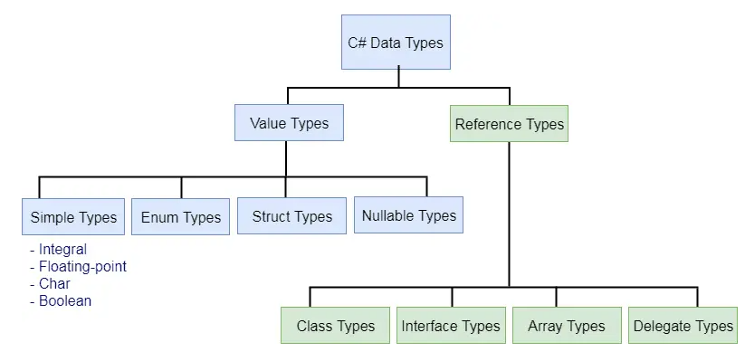

# Introduction to C#

    Course Code: ELEE1149 
    
    Course Name: Software Engineering

    Credits: 15

    Module Leader: Seb Blair BEng(H) PGCAP MIET MIHEEM FHEA

---
## C#

- C# is a modern, innovative, open-source, cross-platform object-oriented programming language and one of the top 5 programming languages on GitHub.

- If you have experience with JavaScript, Java, or C++? 
  - You'll find C# instantly familiar, and you'll enjoy its evolving features including type safety, generics, pattern matching, async, records, and more.

---

## .NET Framework and C#

|C#|.NET|
|---|---|
|A programming language|A developer platform|
|Open-source|Open-source|
|Created by Microsoft|Created by Microsoft|
|Part of the .NET ecosystem|Supports coding in C# and multiple other languages|
|Easy to learn|Hard to learn|
|Used to develop desktop apps, web apps, services, APIs, games, cloud apps, mobile apps| Used for frontend and backend development, cloud, mobile, desktop, web application development, as well as IoT, ML, gaming apps|

---

## Data Types in C#



---

## Implicit and Explicit

- Implicit 
  - `var`
  - ```csharp
    var someNumber = 10
    var someString = "Example of a string"
    ...
    ```
- Explicit
  - `int`,`string`,`char`,`boolean`...
  - ```csharp
    int someNumber = 10
    string someString = "Example of a string"
    ...
    ```
---
## C# - Console Example 

```csharp
Console.WriteLine("Hello World");

var names = new[] { "Ada", "Felipe", "Emilia" };
foreach (var name in names)
{
    Console.WriteLine($"Hello {name}"); //similar to Kotlins string literals
}
```

<details>
<summary>Output</summary>

```
Hello World
Hello Ada
Hello Felipe
Hello Emilia
```
</details>

---

## 101 Keywords


- 14 Modifier Keywords
- 4 Access Modifiers
- 23 Statement Keywords
- 3 Method Parameter Keywords
- 4 Namespace Keywords
- 9 Operator Keywords
- 2 Access Keywords
- 5 Literal Keywords
- 17 Type Keywords
- 6 Contextual Keywords
- 14 Query Keywords


<!--
Total - 101 keywords
- These keywords are reserved... meaning you cannot declare them.
-->
---

## Access Modifiers

<div style="font-size:20pt">

- `public`: The type or member can be accessed by any other code in the same assembly or another assembly that references it. The accessibility level of public members of a type is controlled by the accessibility level of the type itself.
- `private`: The type or member can be accessed only by code in the same class or struct.
`protected`: The type or member can be accessed only by code in the same class, or in a class that is derived from that class.
- `internal`: The type or member can be accessed by any code in the same assembly, but not from another assembly. In other words, internal types or members can be accessed from code that is part of the same compilation.
- `protected internal`: The type or member can be accessed by any code in the assembly in which it's declared, or from within a derived class in another assembly.
- `private protected`: The type or member can be accessed by types derived from the class that are declared within its containing assembly.
</div>

---
##  Naming Convention

- PascalCase
  - class, struct, method, namespace, property, or constant field
```csharp
namespace ExampleApp
{
    class ClassNamingConvention
    {
        public const string ConstantFieldNameingConvention = "c#";
        public string PropertiesNamingConvention {get;set;}

        public void MethodNamingConvention()
        {
            //Something happens here
        }

    }
}
```
---

## Naming Convention

- camelCase
  - method arguments, private fields and local variables
  - private fields are usually prefixed with "_"
```csharp
private string _fieldsNamingConvention;

public void MethodNamingConvention(string methodsArgNamingConvention)
{
    string localVariables = "string here ...";
}
```

---

## Naming Convention
- Indention: Insert spaces for tabs with a tab and indent size of 4
- Variable Declaration: One variable per declaration
- Curly Brackets: Always use brackets even for one line. Start and end brackets in a new line.
- Comments:Use `//` or `///` for commenting, multiline : `/*…*/`
- MagicNumber: Avoid the usage of numbers within expressions or initialisation of variables except if their meaning is obvious. The numbers 0 and 1 when used are usually exempt from this rule.

---

## Meaningful Names

```csharp
class AppNotification
{
    private string _appStatus;
    public string AppStatus
    {
        get { return _appStatus; }
        set { _appStatus = value; }
    }

    public static void SendNotification()
    {
        // something useful here ...
    }
    
}
```
---

##  Labs

You are going to follow a detailed lab on building some C# programs so you can gain some experience.