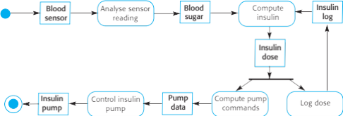
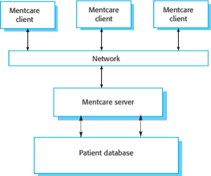

# Introduction to Software Engineering

    Course Code: ELEE1149 
    
    Course Name: Software Engineering

    Credits: 15

    Module Leader: Seb Blair BEng(H) PGCAP MIET MIHEEM FHEA

---

## Software Engineering

- The economies of ALL developed nations are dependent on software
- More and more systems are software controlled
- **Software engineering is concerned with theories, methods and tools for professional software development**
- Expenditure on software represents a significant fraction of GNP in all global north countries
- **Questions:**
  - Does it cost more to develop or to maintain software? Why?
  - What is more expensive on a PC – software or hardware?

---

## Software Costs

- Software costs often dominate computer system costs. The costs of software on a PC are often greater than the hardware cost

- Software costs more to maintain than it does to develop. For systems with a long life, maintenance costs may be several times development costs

- Software engineering is concerned with cost-effective software development

---

## Software Cost Formula

$$ E = a \cdot (KLOC)^b \ \ \ \ \ \ \ \ \ \ \ \  \ \ \ \ \ \ \  T = c \cdot (E)^d$$

Where: 
- E = Effort, T = Development Time, 
- KLOC = Thousands of Lines of Code
- $a$, $b$, $c$ and $d$ are constants defined below:

 
| Software Project| a|b|c|d|
|---|---|---|---|---|
|Organic|3.2|1.05|2.5|0.38|
|Semi-detached|3|1.12|2.5|0.35|
|Embedded|2.8|1.20|2.5|0.32|

---

## Software Project Failure

- **Increasing system complexity**
  - As new software engineering techniques help us to build larger, more complex systems, the demands change. Systems have to be built and delivered more quickly; larger, even more complex systems are required; systems have to have new capabilities that were previously thought to be impossible. 

- **Failure to use software engineering methods**
  - It is easy to write computer programs without using software engineering methods and techniques. Many companies have drifted into software development as their products and services have evolved. They do not use software engineering methods in their everyday work. Consequently, their software is often more expensive and less reliable than it should be

---

## Frequently asked questions about software engineering

What is Software?

Computer programs and associated documentation. Software products may be developed for a particular customer or may be developed for a general market.

What are the attributes of good software?

Good software should deliver the required functionality and performance to the user and should be maintainable, dependable and usable.Computer programs and associated documentation. Software products may be developed for a particular customer or may be developed for a general market.

What is software engineering?

Software engineering is an engineering discipline that is concerned with all aspects of software production.Computer programs and associated documentation.

---

## Frequently asked questions about software engineering

What are the fundamental software engineering activities?

Software specification, software development, software validation and software evolution.

What is the difference between software engineering and computer science?

Computer science focuses on theory and fundamentals; software engineering is concerned with the practicalities of developing and delivering useful software.

What is the difference between software engineering and system engineering?

System engineering is concerned with all aspects of computer-based systems development including hardware, software and process engineering. Software engineering is part of this more general process.

---

## Frequently asked questions about software engineering

What are the key challenges facing software engineering?

Coping with increasing diversity, demands for reduced delivery times and developing trustworthy software.

What are the costs of software engineering?

Roughly 60% of software costs are development costs, 40% are testing costs. For custom software, evolution costs often exceed development costs.

What are the best software engineering techniques and methods?

While all software projects have to be professionally managed and developed, different techniques are appropriate for different types of systems. For example, games should always be developed using a series of prototypes whereas safety critical control systems require a complete and analyzable specification to be developed. You can’t, therefore, say that one method is better than another.

---

## Software Products

- **Generic products**
  - Stand-alone systems that are marketed and sold to any customer who wishes to buy them
  - Examples – PC software such as graphics programs, project management tools; CAD software; software for specific markets such as appointments systems for dentists
- **Customized products**
  - Software that is commissioned by a specific customer to meet their own needs
  - Examples – embedded control systems, air traffic control software, traffic monitoring systems

---

## Product Specification

- **Generic products**
  - The specification of what the software should do is owned by the software developer and decisions on software change are made by the developer
- **Customized products**
  - The specification of what the software should do is owned by the customer for the software and they make decisions on software changes that are required

**Question:** What are the attributes of a good software?

---

## Essential attributes of good software

|Product Characteristic|Decription|
|----|----|
|Maintainability|Software should be written in such a way so that it can evolve to meet the changing needs of customers. This is a critical attribute because software change is an inevitable requirement of a changing business environment.|
|Dependability and Security| Software dependability includes a range of characteristics including reliability, security and safety. Dependable software should not cause physical or economic damage in the event of system failure. Malicious users should not be  able to access or damage the system.|
|Efficiency|Software should not make wasteful use of system resources such as memory and processor cycles. Efficiency therefore includes responsiveness, processing time, memory utilisation, etc.|
|Acceptability|Software must be acceptable to the type of users for which it is designed. This means that it must be understandable, usable and compatible with other systems that they use. |

---

 ## Software Process Activities

- **Software specification**, where customers and engineers define the software that is to be produced and the constraints on its operation
- **Software development**, where the software is designed and programmed
- **Software validation**, where the software is checked to ensure that it is what the customer requires
- **Software evolution**, where the software is modified to reflect changing customer and market requirements

---

## General issues that affect software

- **Heterogeneity**
  - Increasingly, systems are required to operate as distributed systems across networks that include different types of computer and mobile devices 
- **Business and social change**
  - Business and society are changing incredibly quickly as emerging economies develop and new technologies become available. They need to be able to change their existing software and to rapidly develop new software 

---

## General issues that affect software

- **Security and trust**
  - As software is intertwined with all aspects of our lives, it is essential that we can trust that software 
- **Scale**
  - Software has to be developed across a very wide range of scales, from very small embedded systems in portable or wearable devices through to Internet-scale, cloud-based systems that serve a global community 

---

## Software Engineering Diversity

- There are many different types of software systems and there is no universal set of software techniques that is applicable to all of these

- The software engineering methods and tools used depend on the type of application being developed, the requirements of the customer and the background of the development team

---

## Application types

- **Stand-alone applications** 
  - These are application systems that run on a local computer, such as a PC. They include all necessary functionality and do not need to be connected to a network
- **Interactive transaction-based applications**
  - Applications that execute on a remote computer and are accessed by users from their own PCs or terminals. These include web applications such as e-commerce applications 
- **Embedded control systems** 
  - These are software control systems that control and manage hardware devices. Numerically, there are probably more embedded systems than any other type of system 

---

## Application Types

- **Batch processing systems**
  - These are business systems that are designed to process data in large batches. They process large numbers of individual inputs to create corresponding outputs
- **Entertainment systems**
  - These are systems that are primarily for personal use and which are intended to entertain the user
- **Systems for modelling and simulation**
  - These are systems that are developed by scientists and engineers to model physical processes or situations, which include many, separate, interacting objects 

---
## Application Types

- **Data collection systems**
  - These are systems that collect data from their environment using a set of sensors and send that data to other systems for processing 
- **Systems of systems**
  - These are systems that are composed of a number of other software systems 

---

## Software Engineering Ethics

- Software engineering involves wider responsibilities than simply the application of technical skills.
- Software engineers must behave in an honest and ethically responsible way if they are to be respected as professionals.
- Ethical behaviour is more than simply upholding the law but involves following a set of principles that are morally correct

**Question:** What are the key characteristics of ethical behaviour?

---

## Issues of professional responsibility

- **Confidentiality**
  - Engineers should normally respect the confidentiality of their employers or clients irrespective of whether or not a formal confidentiality agreement has been signed.
- **Competence**
  - Engineers should not misrepresent their level of competence. They should not knowingly accept work which is out with their competence.

---

## Issues of professional responsibility

- **Intellectual property rights**
  - Engineers should be aware of local laws governing the use of intellectual property such as patents, copyright, etc. They should be careful to ensure that the intellectual property of employers and clients is protected.
- **Computer misuse** - [CMA 1990](https://www.legislation.gov.uk/ukpga/1990/18/contents)
  - Software engineers should not use their technical skills to misuse other people’s computers. Computer misuse ranges from relatively trivial (game playing on an employer’s machine, say) to extremely serious (dissemination of viruses). 

---

## Case Studies

- **A personal insulin pump**
  - An embedded system in an insulin pump used by diabetics to maintain blood glucose control.
- **A mental health case patient management system**
  - Mentcare. A system used to maintain records of people receiving care for mental health problems.

---

## Insulin Pump Control System

1. Collects data from a blood sugar sensor and calculates the amount of insulin required to be injected.
2. Calculation based on the rate of change of blood sugar levels.
3. Sends signals to a micro-pump to deliver the correct dose of insulin.
4. Safety-critical system as low blood sugars can lead to brain malfunctioning, coma and death; high-blood sugar levels have long-term consequences such as eye and kidney damage.

---

## Activity model of the insulin pump

---

## Essential high-level requirements

- The system shall be available to deliver insulin when required. 
  
- The system shall perform reliably and deliver the correct amount of insulin to counteract the current level of blood sugar.
  
- The system must therefore be designed and implemented to ensure that it always meets these requirements. 

---

## Mentcare: A patient information system for mental health care

- A patient information system to support mental health care is a medical information system that maintains information about patients suffering from mental health problems and the treatments that they have received.

- Most mental health patients do not require dedicated hospital treatment but need to attend specialist clinics regularly where they can meet a doctor who has detailed knowledge of their problems. 

- To make it easier for patients to attend, these clinics are not just run in hospitals. They may also be held in local medical practices or community centres. 

---

## Mentcare

- Mentcare is an information system that is intended for use in clinics. 

- It makes use of a centralized database of patient information but has also been designed to run on a PC, so that it may be accessed and used from sites that do not have secure network connectivity. 

- When the local systems have secure network access, they use patient information in the database but they can download and use local copies of patient records when they are disconnected. 

---

## Mentcare goals

1. To generate management information that allows health service managers to assess performance against local and government targets.

2. To provide medical staff with timely information to support the treatment of patients.

---

## Mentcare System Architecure

---

## Key features of the Mentcare system

- **Individual care management**
  - Clinicians can create records for patients, edit the information in the system, view patient history, etc. The system supports data summaries so that doctors can quickly learn about the key problems and treatments that have been prescribed.
- **Patient monitoring**
  - The system monitors the records of patients that are involved in treatment and issues warnings if possible problems are detected. 
- **Administrative reporting**
  - The system generates monthly management reports showing the number of patients treated at each clinic, the number of patients who have entered and left the care system, number of patients sectioned, the drugs prescribed and their costs, etc. 

---

## Mentcare system concerns

- **Privacy**
  - It is essential that patient information is confidential and is never disclosed to anyone apart from authorised medical staff and the patient themselves. 
- **Safety**
  - Some mental illnesses cause patients to become suicidal or a danger to other people. Wherever possible, the system should warn medical staff about potentially suicidal or dangerous patients.
  - The system must be available when needed otherwise safety may be compromised and it may be impossible to prescribe the correct medication to patients. 