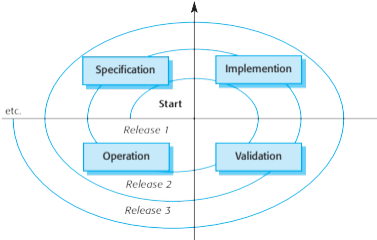
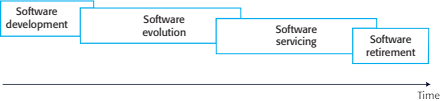
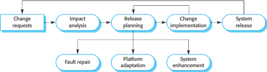
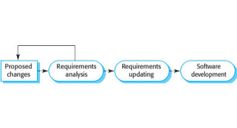
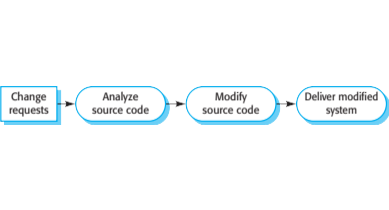
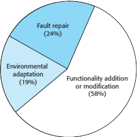
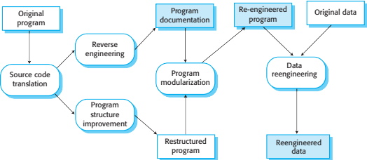
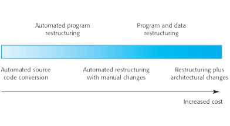

# Software Evolution and Maintenance

    Course Code: ELEE1149 
    
    Course Name: Software Engineering

    Credits: 15

    Module Leader: Seb Blair BEng(H) PGCAP MIET MIHEEM FHEA

---

## Topics to be Covered

- Evolution Processes
- Software Maintenance

---

## Software change

- Software change is inevitable
  - New requirements emerge when the software is used;
  - The business environment changes;
  - Errors must be repaired;
  - New computers and equipment is added to the system;
  - The performance or reliability of the system may have to be improved.
- A key problem for all organizations is implementing and managing change to their existing software systems.

---

## Importance of evolution

- Organisations have huge investments in their software systems - they are critical business assets.

- To maintain the value of these assets to the business, they must be changed and updated.

- The majority of the software budget in large companies is devoted to changing and evolving existing software rather than developing new software.

---

## A spiral model of development and evolution 

---

## Evolution and servicing 

---

## Evolution and servicing

- Evolution
  - The stage in a software system’s life cycle where it is in operational use and is evolving as new requirements are proposed and implemented in the system.
- Servicing
  - At this stage, the software remains useful but the only changes made are those required to keep it operational i.e. bug fixes and changes to reflect changes in the software’s environment. No new functionality is added.
- Phase-out
  - The software may still be used but no further changes are made to it.

---

## Evolution processes

- Software evolution processes depend on
  - The type of software being maintained;
  - The development processes used;
  - The skills and experience of the people involved.
- Proposals for change are the driver for system evolution.
  - Should be linked with components that are affected by the change, thus allowing the cost and impact of the change to be estimated.
- Change identification and evolution continues throughout the system lifetime.

---

## Change identification and  evolution processes 

---

## The software evolution process 

---

## Change implementation 

---

## Change implementation

- Iteration of the development process where the revisions to the system are designed, implemented and tested.

- A critical difference is that the first stage of change implementation may involve program understanding, especially if the original system developers are not responsible for  the change implementation. 

- During the program understanding phase, you have to understand how the program is structured, how it delivers functionality and how the proposed change might affect the program. 

---

## Urgent change requests

- Urgent changes may have to be implemented without going through all stages of the software engineering process
  - If a serious system fault has to be repaired to allow normal operation to continue;
  - If changes to the system’s environment (e.g. an OS upgrade) have unexpected effects;
  - If there are business changes that require a very rapid response (e.g. the release of a competing product).

---

## The emergency repair process

---

## Agile methods and evolution

- Agile methods are based on incremental development so the transition from development to evolution is a seamless one.
  - Evolution is simply a continuation of the development process based on frequent system releases.
- Automated regression testing is particularly valuable when changes are made to a system.
- Changes may be expressed as additional user stories.

---

## Software maintenance

- Modifying a program after it has been put into use.

- The term is mostly used for changing custom software. Generic software products are said to evolve to create new versions.

- Maintenance does not normally involve major changes to the system’s architecture.

- Changes are implemented by modifying existing components and adding new components to the system.

---

## Types of maintenance

- Fault repairs
  - Changing a system to fix bugs/vulnerabilities and correct deficiencies in the way that meets its requirements.

- Environmental adaptation
  - Maintenance to adapt software to a different operating environment
  - Changing a system so that it operates in a different environment (computer, OS, etc.) from its initial implementation.

- Functionality addition and modification 
  - Modifying the system to satisfy new requirements.

---

## Maintenance effort distribution 

---

## Maintenance costs

- Usually greater than development costs (2* to 100* depending on the application).
- Affected by both technical and non-technical factors.
- Increases as software is maintained. Maintenance corrupts the software structure so makes further maintenance more difficult.
- Ageing software can have high support costs (e.g. old languages, compilers etc.).

---

## Maintenance costs

- It is usually more expensive to add new features to a system during maintenance than it is to add the same features during development
  
  - A new team has to understand the programs being maintained
  
  - Separating maintenance and development means there is no incentive for the development team to write maintainable software 
  
  - Program maintenance work is unpopular 
      - Maintenance staff are often inexperienced and have limited domain knowledge.
  
  - As programs age, their structure degrades and they become harder to change 

---

## Complexity metrics

- Predictions of maintainability can be made by assessing the complexity of system components.

- Studies have shown that most maintenance effort is spent on a relatively small number of system components.

- Complexity depends on
  - Complexity of control structures;
  - Complexity of data structures;
  - Object, method (procedure) and module size.

---

## Process metrics

- Process metrics may be used to assess maintainability
  - Number of requests for corrective maintenance;  

  - Average time required for impact analysis;

  - Average time taken to implement a change request;

  - Number of outstanding change requests.

- If any or all of these is increasing, this may indicate a decline in maintainability.

---

## Software reengineering

- Restructuring or rewriting part or all of a legacy system without changing its functionality.

- Applicable where some but not all sub-systems of a larger system require frequent maintenance.

- Reengineering involves adding effort to make them easier to maintain. The system may be re-structured and re-documented.

---

## Advantages of reengineering 

- Reduced risk
  - There is a high risk in new software development. There may be development problems, staffing problems and specification problems.

- Reduced cost
  - The cost of re-engineering is often significantly less than the costs of developing new software.

---

## The reengineering process 

---

## Reengineering process activities

- Source code translation
  - Convert code to a new language.

- Reverse engineering
  - Analyse the program to understand it;

- Program structure improvement
  - Restructure automatically for understandability;

- Program modularisation
  - Reorganise the program structure;

- Data reengineering
  - Clean-up and restructure system data.

---

## Reengineering approaches 

---

## Reengineering cost factors

- The quality of the software to be reengineered.

- The tool support available for reengineering.

- The extent of the data conversion which is required.

- The availability of expert staff for reengineering. 
  - This can be a problem with old systems based on technology that is no longer widely used.

---

## Refactoring

- Refactoring is the process of making improvements to a program to slow down degradation through change.

- You can think of refactoring as ‘preventative maintenance’ that reduces the problems of future change. 

- Refactoring involves modifying a program to improve its structure, reduce its complexity or make it easier to understand. 

- When you refactor a program, you should not add functionality but rather concentrate on program improvement. 

---

## Refactoring and reengineering

- Re-engineering takes place after a system has been maintained for some time and maintenance costs are increasing. You use automated tools to process and re-engineer a legacy system to create a new system that is more maintainable. 

- Refactoring is a continuous process of improvement throughout the development and evolution process. It is intended to avoid the structure and code degradation that increases the costs and difficulties of maintaining a system. 

----

## Bad practices in program code

- Duplicate code 
  - The same or very similar code may be included at different places in a program. This can be removed and implemented as a single method or function that is called as required.
  
- Long methods
  - If a method is too long, it should be redesigned as a number of shorter methods.
- Switch (case) statements 
  - These often involve duplication, where the switch depends on the type of a value. The switch statements may be scattered around a program. In object-oriented languages, you can often use polymorphism to achieve the same thing.

---

## Bad practices in program code

- Data clumping 
  - Data clumps occur when the same group of data items (fields in classes, parameters in methods) re-occur in several places in a program. These can often be replaced with an object that encapsulates all of the data.

- Speculative generality 
  - This occurs when developers include generality in a program in case it is required in the future. This can often simply be removed. 
