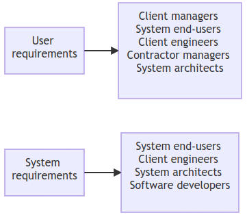

# Requirements Engineering

    Course Code: ELEE1149 
    
    Course Name: Software Engineering

    Credits: 15

    Module Leader: Seb Blair BEng(H) PGCAP MIET MIHEEM FHEA

---

## What is a Requirement?

- A requirement is a statement of a service or a constraint for a system.
- It can range from high-level goals to detailed technical specifications.

**Key Points:**  
- Basis for contracts and system development.  
- Established through the requirements engineering process.

---

## Types of Requirements

### User Requirements  
- High-level descriptions aimed at customers.  
- Example: "The system shall allow users to reset their password."

### System Requirements  
- Detailed technical specifications for developers.  
- Example: "The system shall send an email with a password reset link within 2 seconds."

---

## User and System Requirements Example

**User Requirements Definition**

  **1.** The Mentcare system shall generate monthly reports showing the cost of drugs prescribed by each clinic during that month.

**System Requirements Specification**
   
   **1.1** On the last working day of each month, a summary of the drugs prescribed, their cost and the prescribing clinis shall be generated.
  **1.2** The system shall geneate the report for emailing after 1730 for each clinic on the last working day of the month.
  **1.3** A report shall be created for each clinic and shall list the individual drug names, the total number of prescriptions, the number of doses prescribed and the total cost of the prescribed drugs
...

---

## Readers of different types of requirements specification

---
## System Stakeholders

- Any person or organization who is affected by the system in some way and so who has a legitimate interest
- Stakeholder types
  - End users
  - System managers
  - System owners
  - External stakeholders

Question: Who are the stakeholders in the Mentcare system?

---

## Stakeholders in the Mentcare system

- Patients whose information is recorded in the system.
- Doctors who are responsible for assessing and treating patients.
- Nurses who coordinate the consultations with doctors and administer some treatments.
- Medical receptionists who manage patients’ appointments.
- IT staff who are responsible for installing and maintaining the system.
- A medical ethics manager who must ensure that the system meets current ethical guidelines for patient care.
- Health care managers who obtain management information from the system.
- Medical records staff who are responsible for ensuring that system information can be maintained and preserved, and that record keeping procedures have been properly implemented.

---

## Agile methods and requirements

- Many agile methods argue that producing detailed system requirements is a waste of time as requirements change so quickly. - Therefore, the requirements document is always out of date.

- Agile methods usually use incremental requirements engineering and may express requirements as ‘user stories’ (discussed last week).

- This is practical for business systems but problematic for systems that require pre-delivery analysis (e.g. critical systems) or systems developed by several teams.

---

## Requirements Engineering Process

1. **Elicitation:** Gathering requirements from stakeholders.  
2. **Specification:** Documenting user and system requirements.  
3. **Validation:** Ensuring requirements align with stakeholder needs.  
4. **Management:** Handling changes and conflicts in requirements.

---

## Requirements Elicitation Challenges

- Stakeholders may not know or agree on what they want.  
- Language barriers and domain-specific terminology.  
- Evolving business needs and emerging stakeholders.

**Solution:** Use techniques like interviews, scenarios, and prototypes.

---

## Writing Good Requirements

**Guidelines:**  
- Use a standard format and clear language.  
- Highlight key information.  
- Use "shall" for mandatory requirements and "should" for desirable ones.  
- Include rationale for each requirement.

---

## Validation Techniques

- **Requirements Reviews:** Stakeholder collaboration to identify issues.  
- **Prototyping:** Building a model to test feasibility.  
- **Test Cases:** Ensuring requirements are testable and measurable.

---

## Managing Requirements Changes

- Business and technical environments evolve.  
- Address conflicting user needs through negotiation.  
- Keep the requirements document up-to-date.

---

## Importance of Requirements Engineering

- Reduces project risks and ensures system success.  
- Aligns stakeholder expectations with delivered functionality.  
- Provides a basis for contracts and development plans.

---

## Functional vs Non-Functional Requirements

### Functional Requirements  
- Define specific behaviors or functions of the system.  
- Example: "The system shall allow users to log in with their email and password."

### Non-Functional Requirements  
- Define system constraints like performance or usability.  
- Example: "The system shall respond to user actions within 200ms."

---

## Mentacare system: Functional Requirements

What are the functional requirements for Mentcare system?

- A user shall be able to search the appointments lists for all clinics.
- The system shall generate each day, for each clinic, a list of patients who are expected to attend appointments that day. 
- Each staff member using the system shall be uniquely identified by his or her 8-digit employee number. 

---

## Types of Non-functional Requirements

---

## Non-functional requirements implementation

- Non-functional requirements may affect the overall architecture of a system rather than the individual components. 
  - For example, to ensure that performance requirements are met, you may have to organize the system to minimize communications between components.

- A single non-functional requirement, such as a security requirement, may generate several related functional requirements that define system services that are required. 
  - It may also generate requirements that restrict existing requirements. 

---

## Non-functional Classifications

- Product requirements
  - Requirements which specify that the delivered product must behave in a particular way e.g. execution speed, reliability, etc

- Organisational requirements
  - Requirements which are a consequence of organisational policies and procedures e.g. process standards used, implementation requirements, etc.

- External requirements
  - Requirements which arise from factors which are external to the system and its development process e.g. interoperability requirements, legislative requirements, etc.

---

## Examples of non-functional requirements in the Mentcare system

**Product requirement**
The Mentcare system shall be available to all clinics during normal working hours (Mon–Fri, 0830–17.30). Downtime within normal working hours shall not exceed five seconds in any one day.

**Organizational requirement**
Users of the Mentcare system shall authenticate themselves using their health authority identity card.

**External requirement**
The system shall implement patient privacy provisions as set out in HStan-03-2022-priv. 

---

## Goals and Requirements

- Non-functional requirements may be very difficult to state precisely and imprecise requirements may be difficult to verify. 

- Goal
  - A general intention of the user such as ease of use. They are usually quite general and vague (not easily measurable)

- Verifiable non-functional requirement
  - A statement using some measure that can be objectively tested.

- Goals are helpful to developers as they convey the intentions of the system users.

---

## Usability Requirements
- The system should be easy to use by medical staff and should be organized in such a way that user errors are minimized. (Goal, too general)

- Medical staff shall be able to use all the system functions after four hours of training. After this training, the average number of errors made by experienced users shall not exceed two per hour of system use. (Testable non-functional requirement, more specific and measurable)

---

## Requirements Imprecision

- Problems arise when functional requirements are not precisely stated.
- Ambiguous requirements may be interpreted in different ways by developers and users.
- Consider the term ‘search’ in the first requirement on the previous slide
  - User intention – search for a patient name across all appointments in all clinics;
  - Developer interpretation – search for a patient name in an individual clinic. User chooses clinic then search.

---

## Requirements completeness and consistency

- In principle, requirements should be both complete and consistent.
  
- Complete
  - They should include descriptions of all facilities required.

- Consistent
  - There should be no conflicts or contradictions in the descriptions of the system facilities.

- In practice, because of system and environmental complexity, it is not always possible to produce a complete and consistent requirements document.

----

## Requirements' Evolution

