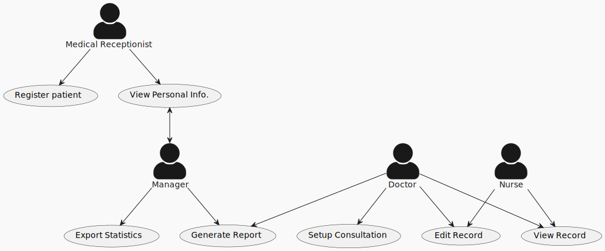

# Requirements Engineering Part 2

    Course Code: ELEE1149 
    
    Course Name: Software Engineering

    Credits: 15

    Module Leader: Seb Blair BEng(H) PGCAP MIET MIHEEM FHEA

---

## Topics Covered

- Requirements' elicitation
- Requirements' specification
- Requirements' validation
- Requirements' change

---

## Requirements' elicitation?

- Software engineers work with a range of system stakeholders to find out about the application domain, the services that the system should provide, the required system performance, hardware constraints, other systems, etc.

- Stages include:

  - Requirements' discovery,
  - Requirements' classification and organization,
  - Requirements' prioritization and negotiation,
  - Requirements' specification.
  
--- 

## Problems of requirements elicitation

- Stakeholders don’t always know what they really want.

- Stakeholders express requirements in their own terms.

- Different stakeholders may have conflicting requirements.

- Organisational and political factors may influence the system requirements.

- The requirements change during the analysis process. New stakeholders may emerge and the business environment may change.

---

## Process Activities

- Requirements' discovery
  - Interacting with stakeholders to discover their requirements. Domain requirements are also discovered at this stage.

- Requirements' classification and organisation
  - Groups related requirements and organises them into coherent clusters.

- Prioritisation and negotiation
  - Prioritising requirements and resolving requirements conflicts.

- Requirements' specification
  - Requirements are documented and input into the next round of the spiral.

---

## Requirements' discovery

- The process of gathering information about the required and existing systems and distilling the user and system requirements from this information.

- Interaction is with system stakeholders from managers to external regulators.
Systems normally have a range of stakeholders.

Question: How do you discover what the requirements for the system are?

- Interviews with stakeholders
- Stories and scenario

---

## Interviewing
- Formal or informal interviews with stakeholders are part of most RE processes.

- Types of interview
  - Closed interviews based on pre-determined list of questions
  - Open interviews where various issues are explored with stakeholders.

- Effective interviewing
  - Be open-minded, avoid pre-conceived ideas about the requirements and are willing to listen to stakeholders. 
  - Prompt the interviewee to get discussions going using an open-ended question, a requirements proposal, or by working together on a prototype system. 

---

## Interviews in practice

- Normally a mix of closed and open-ended interviewing.

- Interviews are good for getting an overall understanding of what stakeholders do and how they might interact with the system.

- Interviewers need to be open-minded without pre-conceived ideas of what the system should do

- You need to prompt the user to talk about the system by suggesting requirements rather than simply asking them what they want

---

## Problems with interviews

- Application specialists may use language to describe their work that isn’t easy for the requirements engineer to understand.

- Interviews are not good for understanding domain requirements
  - Requirements engineers cannot understand specific domain terminology;
  - Some domain knowledge is so familiar that people find it hard to articulate or think that it isn’t worth articulating.

---

## Stories and Scenarios
  
- Scenarios and user stories are real-life examples of how a system can be used.

- Stories and scenarios are a description of how a system may be used for a particular task.

- Because they are based on a practical situation, stakeholders can relate to them and can comment on their situation with respect to the story.

---

## Scenarios

- A structured form of user story

- Scenarios should include
  - A description of the starting situation;
  - A description of the normal flow of events;
  - A description of what can go wrong;
  - Information about other concurrent activities;
  - A description of the state when the scenario finishes.

---

## Requirements' Specification

- The process of writing down the user and system requirements in a requirements document.

- User requirements have to be understandable by end-users and customers who do not have a technical background.

- System requirements are more detailed requirements and may include more technical information.

- The requirements may be part of a contract for the system development
  - It is therefore important that these are as complete as possible.
---

## Ways of writing a system requirements specification 

| Notation                     | Description                                                                                                                                                                                                                                                                                                                                              |
| ---------------------------- | -------------------------------------------------------------------------------------------------------------------------------------------------------------------------------------------------------------------------------------------------------------------------------------------------------------------------------------------------------- |
| Natural language             | The requirements are written using numbered sentences in natural language. Each sentence should express one requirement.                                                                                                                                                                                                                                 |
| Structured natural language  | The requirements are written in natural language on a standard form or template. Each field provides information about an aspect of the requirement.                                                                                                                                                                                                     |
| Design description languages | This approach uses a language like a programming language, but with more abstract features to specify the requirements by defining an operational model of the system. This approach is now rarely used although it can be useful for interface specifications.                                                                                          |
| Graphical notations          | Graphical models, supplemented by text annotations, are used to define the functional requirements for the system; UML use case and sequence diagrams are commonly used.                                                                                                                                                                                 |
| Mathematical specifications  | These notations are based on mathematical concepts such as finite-state machines or sets. Although these unambiguous specifications can reduce the ambiguity in a requirements document, most customers don’t understand a formal specification. They cannot check that it represents what they want and are reluctant to accept it as a system contract |

---

## Requirements and design

- In principle, requirements should state what the system should do and the design should describe how it does this.

- In practice, requirements and design are inseparable
  - A system architecture may be designed to structure the requirements;
  - The system may inter-operate with other systems that generate design requirements;

---

## Natural language specification

- Requirements are written as natural language sentences supplemented by diagrams and tables.

- Used for writing requirements because it is expressive, intuitive and universal. This means that the requirements can be understood by users and customers.

---

## Non-functional requirements implementation

- Non-functional requirements may affect the overall architecture of a system rather than the individual components. 
  - For example, to ensure that performance requirements are met, you may have to organize the system to minimize communications between components.

- A single non-functional requirement, such as a security requirement, may generate several related functional requirements that define system services that are required. 
  - It may also generate requirements that restrict existing requirements. 

---

## Guidelines for writing requirements

- Invent a standard format and use it for all requirements.

- Use language in a consistent way. Use shall for mandatory requirements, should for desirable requirements.

- Use text highlighting to identify key parts of the requirement.

- Avoid the use of computer jargon.

- Include an explanation (rationale) of why a requirement is necessary.

---

## Problems with Natural Language

- Lack of clarity 
  - Precision is difficult without making the document difficult to read.#

- Requirements confusion
  - Functional and non-functional requirements tend to be mixed-up.

- Requirements amalgamation
  - Several different requirements may be expressed together in the same sentence.

---

## Example requirements for the insulin pump software system 

An embedded system in an insulin pump used by diabetics to maintain blood glucose control. It collects data from a blood sugar sensor and calculates the amount of insulin required to be injected based on the rate of change of blood sugar levels. It then sends signals to a micro-pump to deliver the correct dose of insulin.

> 3.2 The system shall measure the blood sugar and deliver insulin, if required, every 10 minutes. (Changes in blood sugar are relatively slow so more frequent measurement is unnecessary; less frequent measurement could lead to unnecessarily high sugar levels.)

>  3.6 The system shall run a self-test routine every minute with the conditions to be tested and the associated actions defined in Table 1. (A self-test routine can discover hardware and software problems and alert the user to the fact the normal operation may be impossible.)
---

##  Structured Specifications

- An approach to writing requirements where the freedom of the requirements writer is limited, and requirements are written in a standard way.

- This works well for some types of requirements e.g., requirements for embedded control system but is sometimes too rigid for writing business system requirements.

---

## Structured form-based specifications

- Definition of the function or entity.

- Description of inputs and where they come from.

- Description of outputs and where they go to.

- Information about the information needed for the computation and other entities used.

- Description of the action to be taken.

- Pre and post conditions (if appropriate).

- The side effects (if any) of the function.)

---

## Tabular specification of computation for an insulin pump Metrics for specifying non-functional requirements

| Condition                                                                                | Action                                                                                 |
| ---------------------------------------------------------------------------------------- | -------------------------------------------------------------------------------------- |
| Sugar level falling (r2 < r1)                                                            | CompDose = 0                                                                           |
| Sugar level stable (r2 = r1)                                                             | CompDose = 0                                                                           |
| Sugar level increasing and rate of increase decreasing  ((r2 – r1) < (r1 – r0))          | CompDose = 0                                                                           |
| Sugar level increasing and rate of increase stable or increasing ((r2 – r1) ≥ (r1 – r0)) | CompDose =       round ((r2 – r1)/4) If rounded result = 0 then CompDose = MinimumDose |

---

## Use cases

- Use-cases are a kind of scenario that are included in the UML. 

- Use cases identify the actors in an interaction and which describe the interaction itself.

- A set of use cases should describe all possible interactions with the system.

- High-level graphical model supplemented by more detailed tabular description.

- UML sequence diagrams may be used to add detail to use-cases by showing the sequence of event processing in the system.

---
## Use case for the mentcare system

---

## Users of a requirements document

---

## The structure of a requirements document 

| Chapter                      | Description                                                                                                                                                                                                                                                                                                                   |
| ---------------------------- | ----------------------------------------------------------------------------------------------------------------------------------------------------------------------------------------------------------------------------------------------------------------------------------------------------------------------------- |
| Preface                      | This should define the expected readership of the document and describe its version history, including a rationale for the creation of a new version and a summary of the changes made in each version.                                                                                                                       |
| Introduction                 | This should describe the need for the system. It should briefly describe the system’s functions and explain how it will work with other systems. It should also describe how the system fits into the overall business or strategic objectives of the organization commissioning the software.                                |
| Glossary                     | This should define the technical terms used in the document. You should not make assumptions about the experience or expertise of the reader.                                                                                                                                                                                 |
| User requirements definition | Here, you describe the services provided for the user. The nonfunctional system requirements should also be described in this section. This description may use natural language, diagrams, or other notations that are understandable to customers. Product and process standards that must be followed should be specified. |
| System architecture          | This chapter should present a high-level overview of the anticipated system architecture, showing the distribution of functions across system modules. Architectural components that are reused should be highlighted.                                                                                                        |

---

## The structure of a requirements document 

| Chapter                           | Description                                                                                                                                                                                                                                                                                                                                                           |
| --------------------------------- | --------------------------------------------------------------------------------------------------------------------------------------------------------------------------------------------------------------------------------------------------------------------------------------------------------------------------------------------------------------------- |
| System requirements specification | This should describe the functional and nonfunctional requirements in more detail. If necessary, further detail may also be added to the nonfunctional requirements. Interfaces to other systems may be defined.                                                                                                                                                      |
| System models                     | This might include graphical system models showing the relationships between the system components and the system and its environment. Examples of possible models are object models, data-flow models, or semantic data models.                                                                                                                                      |
| System evolution                  | This should describe the fundamental assumptions on which the system is based, and any anticipated changes due to hardware evolution, changing user needs, and so on. This section is useful for system designers as it may help them avoid design decisions that would constrain likely future changes to the system.                                                |
| Appendices                        | These should provide detailed, specific information that is related to the application being developed; for example, hardware and database descriptions. Hardware requirements define the minimal and optimal configurations for the system. Database requirements define the logical organization of the data used by the system and the relationships between data. |
| Index                             | Several indexes to the document may be included. As well as a normal alphabetic index, there may be an index of diagrams, an index of functions, and so on.                                                                                                                                                                                                           |

---

## Requirements' validation

- Concerned with demonstrating that the requirements define the system that the customer really wants.
- Requirements error costs are high so validation is very important
  - Fixing a requirements error after delivery may cost up to 100 times the cost of fixing an implementation error.

---

## Requirements' checking

- *Validity*. Does the system provide the functions which best support the customer’s needs?

- *Consistency*. Are there any requirements conflicts?

- *Completeness*. Are all functions required by the customer included?

- *Realism*. Can the requirements be implemented given available budget and technology?

- *Verifiability*. Can the requirements be checked?

---

## Requirements' validation techniques

- Requirements' reviews
  - Systematic manual analysis of the requirements.

- Prototyping
  - Using an executable model of the system to check requirements. 

- Test-case generation
  - Developing tests for requirements to check testability.

---

## Requirements' reviews

- Regular reviews should be held while the requirements definition is being formulated.

- Both client and contractor staff should be involved in reviews.

- Reviews may be formal (with completed documents) or informal. Good communications between developers, customers and users can resolve problems at an early stage.

---

## Review checks

- Verifiability
  - Is the requirement realistically testable?

- Comprehensibility
  - Is the requirement properly understood?

- Traceability
  - Is the origin of the requirement clearly stated?

- Adaptability
  - Can the requirement be changed without a large impact on other requirements?

---

## Changing requirements (1)

- The business and technical environment of the system always changes after installation. 
  - New hardware may be introduced, it may be necessary to interface the system with other systems, business priorities may change (with consequent changes in the system support required), and new legislation and regulations may be introduced that the system must necessarily abide by. 

- The people who pay for a system and the users of that system are rarely the same people. 
  - System customers impose requirements because of organizational and budgetary constraints. These may conflict with end-user requirements, and, after delivery, new features may have to be added for user support if the system is to meet its goals.

---

## Changing requirements (2)

- Large systems usually have a diverse user community, with many users having different requirements and priorities that may be conflicting or contradictory. 
  - The final system requirements are inevitably a compromise between the different users on the community and, with experience, it is often discovered that the balance of support given to different users has to be changed.

---

## Requirements' Evolution

