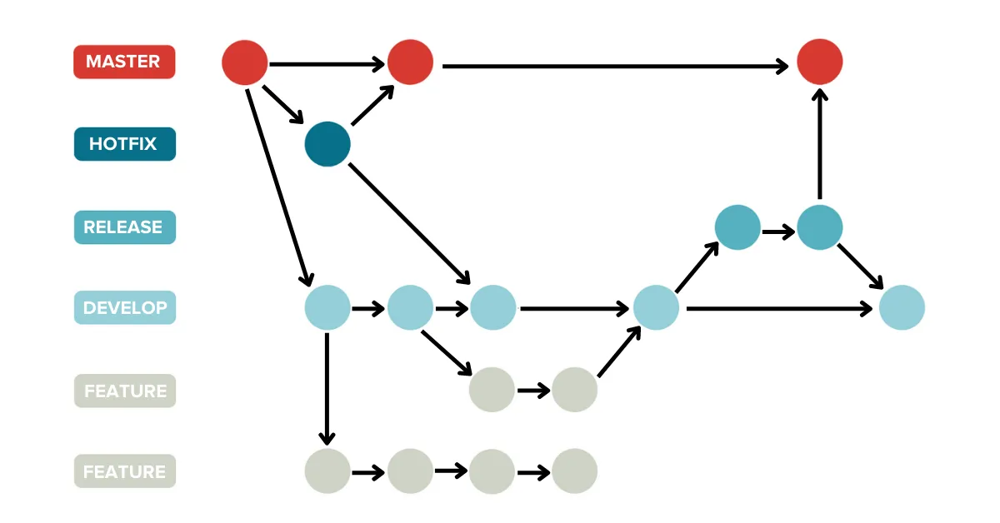
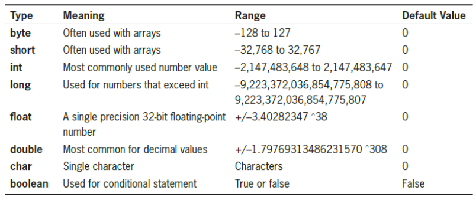

# Revision

    Course Code: ELEE1149 
    
    Course Name: Software Engineering

    Credits: 15

    Module Leader: Seb Blair BEng(H) PGCAP MIET MIHEEM FHEA

---

## Topics

- Version Control

- OOP

- Agile Methodologies

- Software Development

---

## What are Version Control Systems (VCS)

- Tracking and managing changes: 
  - Work fasert and more reliably
  
- Keeps track of all code modifications:
  - Specialised Database (Repository)
  
- Solves Common Team Problems:
  -  Conflicitng concurrent work, 
  - incompatiables due to concurrent working, 
  - having unstable releases

---

## Common Benefits of VCS

**Historical information​** : Looking at the history of changes it is a lot easier to find where bugs have originated. Also, it might be easier to find the right team member best suited to fix an error.​

**Branching​**: Working concurrently on multiple issues, without interference.​ Working on different types of releases.​

**Merging​** : Making sure that team members work does not interfere with each other.​

**Traceability​** : Team members work more fluently together.​

**Testing and Documentation​**: Comments for each change and its association help producing better documentation​. Creating tests is easier​.

---

## Types of VCS

- **Local**:
  - Creates a database on the hardware ​
- **Centralised​**:
  - History of changes kept in a single database in a central server.​
  - Clients need to constantly communicate with the database and receive a partial working copy.​

- **Distributed​**:
  - Single database in a central server that is also distributed among all clients​
  - Each client has a full working copy of the repository​

---
## Git

- Version Control Systems: How to safely organise and backup your software code

- Git: Most popular Version Control System

- GitHub: Version Control System host


---

## Git Characteristics 

- A very popular VCS
- Performance
  - Better performance compared to competitors
  - Deals with the data in the file rather than the file properties
- Security
  - Designed to provided security
  - Uses SHA-256
- Flexibility
  - Non-linear development
  - Detailed log information


--- 

## GitHub - What is it and features?

- Web-based graphical user interface (GUI)
- Features
  - Can act as a project manager
  - Hosts Git repositories
  - Secure with keys


---

## Fundemental Git Functions

All commands are prepended with `git`

- `fetch`, `pull`: Get a working copy of a repository

- `add`,`commit`,`push`: Record a change or changes in at least one of the files stored in the repository.

- `branch`: Create a copy of a repository to be worked independently.

- `merge`: Collates changes of two different copies of a repository.

- `log`: Records information of each change within a repository

---

## Git - Branching



 - **Main**: The default development branch. Whenever you create a Git repository, a branch named "master" is created, and becomes the active branch. 

- **Develop**: This is another branch, which is a way to edit/develop/test code without changing the Master branch. T

- **Topic**: A regular Git branch that is used by a developer to identify a conceptual line of development. 

---

## Git Commands Explained

`clone`​: Get a working copy of the repository​

`fetch`: Update the working copy of the repository without copying or removing any files.​

`pull`: Update the working copy of the repository with copying and removing any files necessary.​

`commit`: Update the working copy with all changes​

`push​`: to the main repository all changes that have been committed to the local working copy.​

`branch​`: Creates a copy of the repository that can be worked independently from the main branch​

`Merge`: Combine two copies of a repository.​ Conflicts may be present.​

---

## Git Repository Staging Area

As part of the version control features there is the **Staging Area**. ​

This is feature enables the developer to move files independently of each other  `git add <filename>` to the repository. Of course you can do this all in one go with `git commit -a​`


--- 


## Git Flow Diagram


---


## Hashing

- Hashes are intended to be nearly universally unique. It is **NOT** guaranteed but it is extremely unlikely that the same SHA's are generated for different content. In practical term for a given project you can treat it as unique.

- A single, monotonically increasing revision number only really makes sense for a centralized version control system, where all revisions flow to a single place that can track and assign numbers. Once you get into the DVCS world, where numerous copies of the repository exist and changes are being pulled from and pushed to them in arbitrary workflows, the concept just doesn't apply.

---

## Learning Git

[https://learngitbranching.js.org/​](https://learngitbranching.js.org)


---

## OOP Key Concepts

- Classes and Objects

- Encapsulation

- Inheritance 

- Polymorphism

---

## Classes & Objects (1) 


> **Classes** are software programming models - abstractions of the real world or system entities. 

- Classes have *state* and *behaviour*

- *Variables* are used to describe the state of the class and methods are used to describe behaviour

- Classes are collections of objects with common structure, common behaviour, common relationships and common semantics

- Objects belong to a particular class, objects are instances of a particular class 

---

## Classes & Objects (2)

- **Class**
  - a template that describes the data and behaviour associated with instances of that class
  - the basic building block of an object-oriented language such as Java, C++, etc.
  - classes are data types and can be used to create multiple objects

- **Object**
  - represents something with which we can interact with in a program
  - an object’s behaviour defines a collection of services that we can tell it to perform for us
  - a class is abstract and represents a concept, and an object represents an instance (realization) of a class 

---

## Class - an Example

<div align=center>


</div>

---

## Class – an Example 2

<div align=center>


</div>


---

## Encapsulation (1)

- Any changes to the object's state (i.e. its variables) should be made only via that object's methods

- We should make it difficult, if not impossible, to access an object’s variables other than via its methods

- The user can request the object’s services, but s/he should not have to be aware of how those services are implemented

---

## Encapsulation (2)

- Data and methods are tied together in classes in OOP, i.e. classes *encapsulate* data representation and behaviour

- The user can view an object as a black box - s/he is not interested in the implementation but in the *interfaces* to the object

- information hiding - implementation details are hidden within the classes using `private` keyword
  - Examples - car, TV set, domestic appliances

---

## Encapsulation (3)

Encapsulation principle means that we should add to the same class behavioral methods (drive, stop, etc.).

<div align=center>


</div>

---

## Primitive Data Types



---

## Primitive Data Types max and min

- `int16` is a 16bit number... $2^{16}$
  
  - $-32768 =\frac{2^{16}}{2}$
  - $32767 =\frac{2^{16}}{2}-1$
- `int32` is a 32bit number... $2^{32}$
  
  -  $-2147483648 =\frac{2^{32}}{2}$
  -  $+2147483647=\frac{2^{32}}{2}-1$

`uint` is an unsigned number

- `uint16` is ... 
  - 0 : 65535 ($2^{16}-1$)    
- `unit32` is ...
  - 0 : 4294967295 ($2^{32}-1$) 

---

## `static` and `this`

- `this` points to an instance of the `class`, in the `static` method you don't have an instance.

- The `this` keyword refers to the current instance of the `class`. `static` member functions do not have a this pointer

- You'll notice the definition of a `static` member is:

- Use the `static` modifier to declare a `static` member, which belongs to the type itself rather than to a specific object

- Which is why `this` has nothing to point to.

---

## OOP - Abstraction

- Data abstraction is the process of hiding certain details and showing only essential information to the user.

- Abstraction can be achieved with either abstract classes or interfaces (which you will learn more about in the next chapter).

- The `abstract` keyword is used for classes and methods:

- Abstract `class`: is a restricted `class` that cannot be used to create objects (to access it, it must be inherited from another `class`).

- Abstract `method`: can only be used in an abstract `class`, and it does not have a body. The body is provided by the derived `class` (inherited from).
An `abstract` `class` can have both `abstract` and regular methods:

---

```csharp
// Abstract class
abstract class Animal
{
  // Abstract method (does not have a body)
  public abstract void animalSound();
  // Regular method
  public void sleep()
  {   Console.WriteLine("Zzz"); }
}

// Derived class (inherit from Animal)
class Pig : Animal
{
  public override void animalSound()
  {
    // The body of animalSound() is provided here
    Console.WriteLine("The pig says: wee wee");
  }
}

class Program
{
  static void Main(string[] args)
  {
    Pig myPig = new Pig(); // Create a Pig object
    myPig.animalSound();  // Call the abstract method
    myPig.sleep();  // Call the regular method
  }
}

```

--

## Inheritance (1)

- Reuse do not reinvent!

- By using existing software components to create new ones, we take advantage of all the effort that went into the design, implementation, and 

- testing of the existing software

- Inheritance is the main idea behind existing classes in Java libraries - use them and adapt them to your own needs


---

## Inheritance (2)

- Inheritance allows a software developer to derive a new class from an existing one

- The new class (also called the child) inherits characteristics of the parent, i.e. the child inherits the methods and data defined in the parent class

- The original class is called superclass (base class, parent) 

- The new class is called subclasses (derived class, child)

- To tailor a derived class, the programmer can add new variables or methods, or can modify the inherited ones

---

## Single & Multiple Inheritance 

- Depending on the number of the superclasses a subclass is derived from the inheritance could be:
  - single inheritance - a subclass is derived from just one superclass, i.e. a child class can have only one parent class or
  - multiple inheritance - a subclass is derived from more than one superclass, inheriting the members of all parents, i.e. a child class can have two or more parents classes 
    - Example: family tree

---

## Single Inheritance in Java

We are using the keyword extends in Java to implement single inheritance

Example	

```csharp
  //           SubClass      SuperClass            
  public class MyClass extends Applet {
     // ...some code...
   }
```

---

## Inheritance (Derived and Base Class)
In C#, it is possible to inherit fields and methods from one class to another. We group the "inheritance concept" into two categories:

- Derived Class (child) - the class that inherits from another class
- Base Class (parent) - the class being inherited from

To inherit from a class, use the `:` symbol.

In the example on next slide, the `Car class` (child) inherits the fields and methods from the `Vehicle class` (parent):

---

## Inheritance

```csharp
class Vehicle  // base class (parent) 
{
  public string brand = "Ford";  // Vehicle field
  public void honk()             // Vehicle method 
  {                    
    Console.WriteLine("Tuut, tuut!");
  }
}

class Car : Vehicle  // derived class (child)
{
  public string modelName = "Mustang";  // Car field
}

class Program
{
  static void Main(string[] args)
  {
    // Create a myCar object
    Car myCar = new Car();

    // Call the honk() method (From the Vehicle class) on the myCar object
    myCar.honk();

    // Display the value of the brand field (from the Vehicle class) and the value of the modelName from the Car class
    Console.WriteLine(myCar.brand + " " + myCar.modelName);
  }
}
```
---

## Polymorphism

- From Greek, means “many forms”

- Allows us to process objects of all existing classes in a hierarchy in an uniform manner

- The main idea behind polymorphism is to have just one interface and multiple methods 

- The concept of polymorphism  let us use same name for more than one different purpose

- Example: overloaded constructors – same name, different parameters
This approach can be applied to every other method!


---

## Polmorphism 2

```java
class Shapes {
  public void area() {
    System.out.println("The formula for area of ");
  }
}

class Triangle extends Shapes {
  public void area() {
    System.out.println("Triangle is ½ * base * height ");
  }
}

class Circle extends Shapes {
  public void area() {
    System.out.println("Circle is 3.14 * radius * radius ");
  }
}

class Main {
  public static void main(String[] args) {
    Shapes myShape = new Shapes();  // Create a Shapes object
    Shapes myTriangle = new Triangle();  // Create a Triangle object
    Shapes myCircle = new Circle();  // Create a Circle object
    myShape.area();
    myTriangle.area();
    myShape.area();
    myCircle.area();
  }
}
```

---

## Difference between Inhertiance and Polymorphism

|INHERITANCE|POLYMORPHISM|
|---|---|
|1.	Inheritance is one in which a new class is created (derived class) that inherits the features from the already existing class(Base class).|Whereas polymorphism is that which can be defined in multiple forms.|
|2.	It is basically applied to classes.|	Whereas it is basically applied to functions or methods.|
|3.	Inheritance supports the concept of reusability and reduces code length in object-oriented programming.	|Polymorphism allows the object to decide which form of the function to implement at compile-time (overloading) as well as run-time (overriding).|
|4.	Inheritance can be single, hybrid, multiple, hierarchical and multilevel inheritance.|	Whereas it can be compiled-time polymorphism (overload) as well as run-time polymorphism (overriding).|
|5.	It is used in pattern designing.	|While it is also used in pattern designing.|

---

## Software process models

A software process is a structured set of activities required to develop a software system. 

<details>
<summary>Question: What kind of activities are involved in developing a mobile app?</summary>

 - Many different software processes but all involve:
    - **Specification** – defining what the system should do;
    - **Design and implementation** – defining the organization of the system and implementing the system;
    - **Validation** – checking that it does what the customer wants;
    - **Evolution** – changing the system in response to changing customer needs.

</details>
<p></p>
A software process model is an abstract representation of a process. It presents a description of a process from some particular perspective.

---

## Software Process Descriptions

Process descriptions may also include:
- Products or deliverables, which are the outcomes of a process activity; 
- Roles, which reflect the responsibilities of the people involved in the process;
- Pre- and post-conditions, which are statements that are true before and after a process activity has been enacted or a product produced
>  - **Example**: before architectural design begins, a precondition might be the customer has approved all requirements; after this activity is finished, a post-condition might be the UML model  describing the architecture has been reviewed

<!--
When we describe and discuss software processes, we usually talk about the activities in these processes such as specifying a data model, designing a user interface, etc. and the ordering of these activities.
-->

---

## Plan-driven and Agile processess

- **Plan-driven processes** are processes where all of the process activities are planned in advance and progress is measured against this plan. 
- In **agile processes**, planning is incremental and it is easier to change the process to reflect changing customer requirements. 

>In practice, most practical processes include elements of both plan-driven and agile approaches. 

**Question:** Which approach you think is most appropriate to use for:
- Safety critical systems, e.g. air traffic control? Why?
- Business systems, e.g. a mobile app? Why?

---

## Plan-driven and Agile Processes
Therefore:-

- **Plan-drive** is for safety-critical systems, a very structured development process is required where detailed records are maintained

- **Agile Processes** is for business systems, with rapidly changing requirements, and more flexible, agile process is likely to be better

---

## Software Process Models

- **The waterfall model**
  - Plan-driven model. Separate and distinct phases of specification and development.
- **Incremental development**
  - Specification, development and validation are interleaved. May be plan-driven or agile.
- **Integration and configuration**
  - The system is assembled from existing configurable components. May be plan-driven or agile.

>In practice, most large systems are developed using a process that incorporates elements from all of these models.

---

## Design Stage

Four possible approaches to object indentifcation

1. A **grammatical approach** based on a natural language description of the system objects and attributes are nouns; operations or services are verbs.

2. The **identification of tangible** things in the application domain such as aircraft.
3. A **behavioural approach** and identify objects based on what participates in what behaviour such as managers manage.
4. A **scenario-based analysis**. The objects, attributes and methods in each scenario are identified.

---

## Five Main Archiectres and system Characteristics

- Performance
   - Localize critical operations and minimize communications. Use large rather than fine-grain components.
- Security
  -  Use a layered architecture with critical assets in the inner layers.
- Safety
     - Localize safety-critical features in a small number of sub-systems.
- Availability
    - Include redundant components and mechanisms for fault tolerance.
- Maintainability
     -  Use fine-grain, replaceable components.

---

## UML 

- Revisit these secion on UMLs:
  - [https://teachingmaterial.github.io/ELEE1149_Exercises/Lab_10/Lab_10.html](https://teachingmaterial.github.io/ELEE1149_Exercises/Lab_10/Lab_10.html)
  - [https://teachingmaterial.github.io/ELEE1149_Exercises/Lab_11/Lab_11.html](https://teachingmaterial.github.io/ELEE1149_Exercises/Lab_11/Lab_11.html)

---

## Good luck and have a good time in the exam!


