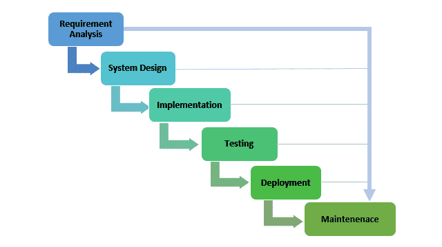
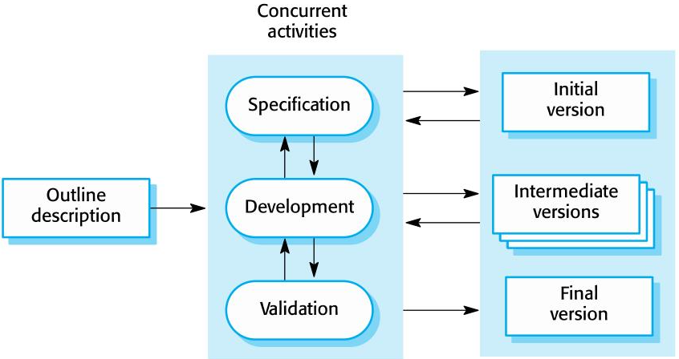

# Software Development Life Cycle (SDLC)

    Module Code: ELEE1149

    Module Name: Software Engineering

    Credits: 15

    Module Leader: Seb Blair BEng(H) PGCAP MIET MIHEEM FHEA

---

## What is SDLC

The Software Development Lifecycle (SDLC) is a structured approach to software development that ensures the creation of high-quality software, delivered on time and within budget. 

- Software Process Models
- Planning
- Requirements Engineering
- System Modelling
- Implementation
- Testing
- Deployment
- Maintenance

---

## Software Process Models

- **Waterfall**
  - A sequential software development model where each phase—requirements, design, implementation, testing, deployment, and maintenance—must be completed before moving to the next, making it ideal for well-defined projects with minimal expected changes.

- **Agile**
  - A flexible, iterative approach emphasizing collaboration, customer feedback, and adaptive planning to deliver smaller, functional increments of software rapidly and efficiently.

- **DevOps**
  - A culture and set of practices combining development (Dev) and operations (Ops) teams to automate processes, improve collaboration, and ensure continuous integration and delivery (CI/CD) for faster and more reliable software delivery.

>In practice, most large systems are developed using a process that incorporates elements from all of these models.

---

## Waterfall Model

---

## Waterfall Model - Appropriateness

 Question: What are the benefits of using this model? What kind of systems is this model good to be used for? 

- **Embedded systems** – because the inflexibility of hardware the requirements need to be clear before any implementation is carried out

- **Critical systems** – there is a need for extensive safety and security analysis of the software specification and design.  They must be complete so that this analysis is possible. 

- **Large software systems**

---

## Incremental Development Model

---

## Incremental Development 

- Based on the idea of developing an initial implementation, getting feedback from users, and evolving the software through several versions until the required system has been developed

- Specification, development, and validation activities are interleaved rather than separate, with rapid feedback across activities
- This is the most common approach for application systems and software product development

---

## Integration and Configuration

- Based on software reuse where systems are integrated from existing components or application systems (sometimes called COTS -Commercial-off-the-shelf) systems).

- Reused elements may be configured to adapt their behaviour and functionality to a user’s requirements

- Reuse is now the standard approach for building many types of business systems

---

## Planning

This initial phase involves gathering requirements and defining the project scope, which includes setting goals, budgets, and timelines. It's crucial for laying the foundation of the project.

- Costing COCOMO
- planning Kanban (covered in week 5)

---

## Software Costs

- Software costs often dominate computer system costs. The costs of software on a PC are often greater than the hardware cost

- Software costs more to maintain than it does to develop. For systems with a long life, maintenance costs may be several times development costs

- Software engineering is concerned with cost-effective software development

---

## COCOMO (Constructive Cost Model)

COCOMO is a software cost estimation model developed by Barry Boehm in 1981. It estimates the effort, cost, and time required to develop a software system based on project size.

- Three COCOMO Models

  1. **Basic COCOMO**: Rough estimation based on project size.
  2. **Intermediate COCOMO**: Considers cost drivers like hardware constraints, team experience.
  3. **Detailed COCOMO (COCOMO II)**: Adds more precision with lifecycle phases.

---

## Key Components of COCOMO

1. **Size Estimation** (in KLOC - thousand lines of code)
   - Example: A project with 25,000 lines of code is 25 KLOC.
   
2. **Effort Equation Estimation**: 
   - Effort (in person-months*) = $a * (KLOC)^b$
   - Constants **a** and **b** differ for project types.

- Project Types in COCOMO

  1. **Organic**: Simple projects, small teams, well-understood problems (e.g., payroll systems).
  2. **Semi-detached**: Moderately complex, mixed teams (e.g., medium business systems).
  3. **Embedded**: Complex, real-time systems with stringent requirements.

*refers to the number of months a single person would take to complete a specific task or project, assuming full-time work.

---

## Effort Estimation Example

For a 25 KLOC organic project:
- Constants for organic project: **a = 2.4**, **b = 1.05**

$$ Effort\ =\ 2.4 \cdot (25)^{1.05}\ ≈\ 61.56\ person-months $$

## Development Time Estimation

Development time (TDEV)*:
$$TDEV\ =\ c\ \cdot (Effort)^d$$
- Constants: **c = 2.5**, **d = 0.38**

$$Time\ =\ 2.5 \cdot (61.56)^{0.38}\ ≈\ 13.36\ months$$

*actual calendar time required to complete the project.

---

## COCOMO Advantages

- Objective estimates from historical data.
- Adaptable to different project types.
- Accounts for various development factors (personnel, tools, etc.).

## COCOMO Limitations

- Relies on accurate size estimation.
- Historical data may not suit modern practices.
- Assumes equal contribution of all code to effort.

--- 

## Requirments Engineering

Developers and stakeholders work together to gather and define the software’s functional and non-functional requirements. This is followed by documenting the requirements in a formal specification to guide the development process 

- **Functional**
  - describes the specific behaviors, actions, or functionalities that a system must suppor

- **Non-functional**
  - specifies the quality attributes or constraints of a system, such as performance, security, scalability, and usability

*Covered in detail in week 3.*

---

## Design

System design is divided into high-level design (HLD) and low-level design (LLD). HLD defines the system architecture, while LLD focuses on specifics like data structures and algorithms

- **UML diagrams**
  - **Activity diagrams**, which show the activities involved in a process or in data processing .

  - **Use case diagrams**, which show the interactions between a system and its environment. 

  - **Sequence diagrams**, which show interactions between actors and the system and between system components.

  - **Class diagrams**, which show the object classes in the system and the associations between these classes.

  - **State diagrams**, which show how the system reacts to internal and external events. 
  
  *Covered in week 4.

---

## Implementation (Coding)

Developers begin writing the actual code based on the design documents. Version control systems are typically used, and the code is reviewed regularly to maintain quality

- **Reuse** Most modern software is constructed by reusing existing components or systems. When you are developing software, you should make as much use as possible of existing code.
- **Configuration management** During the development process, you have to keep track of the many different versions of each software component in a configuration management system.
- **Host-target development** Production software does not usually execute on the same computer as the software development environment. Rather, you develop it on one computer (the host system) and execute it on a separate computer (the target system).

*Covered in week 6

---

## Testing

The software undergoes rigorous testing, including unit, integration, and system testing, to identify and fix bugs. User Acceptance Testing (UAT) ensures the software meets the user's needs​.

- Feature Tests 

- Functional Testing

- Performace and Load Testing

- Security Testing

- Test Driven Development

- Unit Testing
  
- User Testing

*Covered in week 8

---

## CI/CD (Deployment & Maintenance)

- Continous Integration and Contionus Deployment

  - Once testing is completed, the software is deployed in the production environment. The deployment could be done in phases or all at once, depending on the project's scale​

  - After deployment, the software enters the maintenance phase, where it is regularly updated, bugs are fixed, and improvements are made based on user feedback

*Covered throughout, but specifically week 11