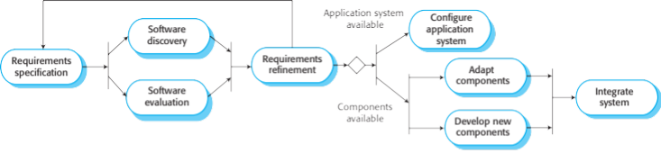

# Software Process Models

    Course Code: ELEE1149 
    
    Course Name: Software Engineering

    Credits: 15

    Module Leader: Seb Blair BEng(H) PGCAP MIET MIHEEM FHEA

---

## The Software Process

A software process is a structured set of activities required to develop a software system. 

Question: What kind of activities are involved in developing a mobile app?

 - Many different software processes but all involve:
    - **Specification** – defining what the system should do;
    - **Design and implementation** – defining the organization of the system and implementing the system;
    - **Validation** – checking that it does what the customer wants;
    - **Evolution** – changing the system in response to changing customer needs.

A software process model is an abstract representation of a process. It presents a description of a process from some particular perspective.

---

## Software Process Descriptions

Process descriptions may also include:
- Products or deliverables, which are the outcomes of a process activity; 
- Roles, which reflect the responsibilities of the people involved in the process;
- Pre- and post-conditions, which are statements that are true before and after a process activity has been enacted or a product produced
>  - **Example**: before architectural design begins, a precondition might be the customer has approved all requirements; after this activity is finished, a post-condition might be the UML model  describing the architecture has been reviewed

<!--
When we describe and discuss software processes, we usually talk about the activities in these processes such as specifying a data model, designing a user interface, etc. and the ordering of these activities.
-->

---

## Plan-driven and Agile processess

- **Plan-driven processes** are processes where all of the process activities are planned in advance and progress is measured against this plan. 
- In **agile processes**, planning is incremental and it is easier to change the process to reflect changing customer requirements. 

>In practice, most practical processes include elements of both plan-driven and agile approaches. 

**Question:** Which approach you think is most appropriate to use for:
- Safety critical systems, e.g. air traffic control? Why?
- Business systems, e.g. a mobile app? Why?

---

## Plan-driven and Agile Processes
Therefore:-

- **Plan-drive** is for safety-critical systems, a very structured development process is required where detailed records are maintained

- **Agile Processes** is for business systems, with rapidly changing requirements, and more flexible, agile process is likely to be better

---

## Software Process Models

- **The waterfall model**
  - Plan-driven model. Separate and distinct phases of specification and development.
- **Incremental development**
  - Specification, development and validation are interleaved. May be plan-driven or agile.
- **Integration and configuration**
  - The system is assembled from existing configurable components. May be plan-driven or agile.

>In practice, most large systems are developed using a process that incorporates elements from all of these models.

---

## Waterfall Model

---

## Waterfall Model Phases

There are separate identified phases in the waterfall model:

- **Requirements analysis** - the system’s services, constraints, and goals are established by consultation with the system’s users
- **System design** - establishes the overall system architecture
- **Implementation**  - developing the software/system0
- **(Unit) testing**  - involves verifying that each unit meets its specification
- **Deployment** - the system is installed and put into practical use
- **Maintenance** - involves correcting errors, improving the implementation and enhancing the system’s services as new requirements are discovered.

---
## Waterfall Model - Appropriateness

 Question: What are the benefits of using this model? What kind of systems is this model good to be used for? 

- **Embedded systems** – because the inflexibility of hardware the requirements need to be clear before any implementation is carried out

- **Critical systems** – there is a need for extensive safety and security analysis of the software specification and design.  They must be complete so that this analysis is possible. 

- **Large software systems**

---

## Waterfall Model Problems

- Once an application is in the testing stage, it is very difficult to go back and change something that was not well-thought out in the concept stage.
- No working software is produced until late during the life cycle.
- High amounts of risk and uncertainty.
- Not a good model for complex and object-oriented projects.
- Poor model for long and ongoing projects.
- Not suitable for the projects where requirements are at a moderate to high risk of changing.

---

## Incremental Development Model

---

## Incremental Development 

- Based on the idea of developing an initial implementation, getting feedback from users, and evolving the software through several versions until the required system has been developed

- Specification, development, and validation activities are interleaved rather than separate, with rapid feedback across activities
- This is the most common approach for application systems and software product development

---

## Incremental Development Benefits

- The cost of accommodating changing customer requirements is reduced. 
  - The amount of analysis and documentation that has to be redone is much less than is required with the waterfall model.
- It is easier to get customer feedback on the development work that has been done. 
  - Customers can comment on demonstrations of the software and see how much has been implemented. 
- More rapid delivery and deployment of useful software to the customer is possible. 
  - Customers are able to use and gain value from the software earlier than is possible with a waterfall process. 

---

## Incremental Development Problems

- The process is not visible
  - Managers need regular deliverables to measure progress. If systems are developed quickly, it is not cost-effective to produce documents that reflect every version of the system. 
- System structure tends to degrade as new increments are added.  
  - Unless time and money is spent on code refactoring to improve the software, regular change tends to corrupt its structure. Incorporating further software changes becomes increasingly difficult and costly. 

Question: What does code refactoring means?

**Code refactoring** is the process of restructuring existing code – changing the factoring without changing its external behaviour

---

## Integration and Configuration

- Based on software reuse where systems are integrated from existing components or application systems (sometimes called COTS -Commercial-off-the-shelf) systems).

- Reused elements may be configured to adapt their behaviour and functionality to a user’s requirements

- Reuse is now the standard approach for building many types of business systems

---

## Types of reusable software

- Stand-alone application systems (sometimes called COTS) that are configured for use in a particular environment.

- Collections of objects that are developed as a package to be integrated with a component framework such as .NET or J2EE.

- Web services that are developed according to service standards and which are available for remote invocation. 

---

## Reuse-Oriented Software Engineering

---

## Reuse-Oriented Software Engineering: Key Process Stages

- **Requirements specification** – initial requirements are proposed
- **Software discovery and evaluation** – given the requirements, a search is made for components and systems that provide the functionality required
- **Requirements refinement** – requirements are refined using information about the reusable components and applications that have been discovered
- **Application system configuration** – if an off-the-shelf application system that meets the requirements is available, it may then be configured for use to create the new system
- **Component adaptation and integration** – if there is no off-the-shelf system, individual reusable components may be modified and new components developed which are then integrated to create the system

---

## Reuse-Oriented Software Engineering: Adv & Disadv

Question: What are the benefits of using this model? 

- Reduced costs and risks as less software is developed from scratch
- Faster delivery and deployment of system

Question: What are the drawbacks of using this model?

- Requirements compromises are inevitable so system may not meet real needs of users
- Loss of control over evolution of reused system elements

