# System Modelling Part 1

    Course Code: ELEE1149 
    
    Course Name: Software Engineering

    Credits: 15

    Module Leader: Seb Blair BEng(H) PGCAP MIET MIHEEM FHEA

---

## System modelling

- System modelling is the process of developing abstract models of a system, with each model presenting a different view or perspective of that system. 

- System modelling is representing a system using graphical notation, which is now almost always based on notations in the Unified Modelling Language (UML). 

- System modelling helps the analyst to understand the functionality of the system and models are used to communicate with customers.

---

## UML diagram types

- **Activity diagrams**, which show the activities involved in a process or in data processing .

- **Use case diagrams**, which show the interactions between a system and its environment. 

- **Sequence diagrams**, which show interactions between actors and the system and between system components.

- **Class diagrams**, which show the object classes in the system and the associations between these classes.

- **State diagrams**, which show how the system reacts to internal and external events. 

Question: Why use graphical models?

---

## Mentcare system & sub-systems


---

## Process perspective

- Context models simply show the other systems in the environment, not how the system being developed is used in that environment.

- Business Process models reveal how the system being developed is used in broader business processes.

- UML activity diagrams may be used to define business process models. They show the activities in a process and the flow of control from one activity to another

---

## Process model of involuntary detention using UML activity diagram

<!--
https://mermaid.live/edit#pako:eNqFlN1u4jAQhV_F8uWKvkBUIaEgBKKgKA5XBFXe2AFvExs5ptqq6rvvjJ0faCjLVezzZXwyc_AnLYyQNKKN407OFT9aXueawE8oKwunjCYvadjxDFHla3h4fi5ORhVyOg1yPJ9HJDa6VLbOYUtIJzUWCItCNfjs0VVi0oisdGkCmnCngCWmxFWqjifXBDLFoqksjBUoza9rzm9qsk0cgSfCPhonawKucr0BuACvgViwJCILpQVpZHGxEmucK1608ixbRmQmauWIM6gtTXNWjldt_Rkb1Ue6QQsNLIIQ4CxLgM4s100pbVsvMRW0izDoXu86y9hyBAZ7385fsfi6ZcwUipOY29b9arvuZKLlX4eMKclatQftoOG7s8BmYIvlUYFbS3Kdt8D-14E8PU1xjGGjGziUfOtHjotu4H7k_p0B6ZSrlxDAgf8gpcN5MMJh69bEH6N0bwIXgwms7V8bmE5KW39j5aoeAl2oO7kPOYoLXjUyInvB9VFac2kO5C6X2Qti2jgyoB2JYqjGkm7PF_abkL3hiyFpw2ZLsiQc4XPlj-DvXFX8dyUPYwgztR8D35sKOTNavD4YMFjwJcdk_13g6D4yEGz5M9E7Gp3gc8Pi_wDb9WNgl96NkjspG9hxnlg8hGbgenm7fiTv0kdql_BdehPEKzeowl-RTmgtbc2VgMv50zeKupOsZU4jeBQcatJcfwHHL86wD13QyEHGJvTi_-XtXU6jEkM2oVIoZ-wm3Pb-0v_6B5zY344
-->

---

## Interaction models

- Modelling user interaction is important as it helps to identify user requirements. 

- Modelling *component interaction* helps us understand if a proposed system structure is likely to deliver the required system performance and dependability. 

- *Use case diagrams* – used to model the interactions between a system and external agents - human users or other systems

- *Sequence diagrams* – used to model interactions between system components

---

## Use case modeling

- A *use case* is a simple description of what a user expects from a system in the interaction

- Each use case represents a discrete task that involves external interaction with a system.

- As use cases give a simple overview of an interaction (represented by a verb), more detail needs to be added in the form of textual description, a structured description in a table, or a sequence diagram

- *Actors* in a use case may be people or other systems.
A use case is shown as an ellipse and the actors involved – as stick figures

---

## Transfer-data use case diagram 

- A use case in the Mentcare system

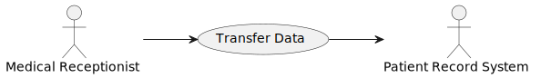

---

## Tabular description of the  Transfer-data use case 

<table>
    <thead>
        <tr>
            <th colspan=2>MHC-PMS: Transfer data</th>
        </tr>
    </thead>
    <tbody>
        <tr>
            <td>
             Actors
            </td>
            <td>
            Medical receptionist, patient records system (PRS)
            </td>
        </tr>
        <tr>
            <td>
             Description
            </td>
            <td>
            A receptionist may transfer data from the Mentcase system to a general patient record database that is maintained by a health authority. The information transferred may either be updated personal information (address, phone number, etc.) or a summary of the patient’s diagnosis and treatment.Medical receptionist, patient records system (PRS)
            </td>
        </tr>
        <tr>
            <td>
             Data
            </td>
            <td>
            Patient’s personal information, treatment summary
            </td>
        </tr>
        <tr>
          <td>
             Stimulus
          </td>
           <td>
            User command issued by medical receptionist
          </td>
        </tr>
        <tr>
          <td>
             Response
          </td>
           <td>
            Confirmation that PRS has been updated
          </td>
        </tr>
        <tr>
          <td>
             Comments
          </td>
           <td>
            The receptionist must have appropriate security permissions to access the patient information and the PRS.
          </td>
        </tr>
    </tbody>
</table>

---

## Use cases in the Mentcare system involving the role ‘Medical Receptionist’ 

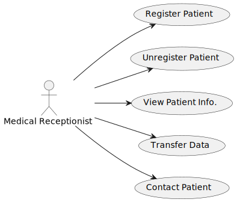

<!--
https://www.plantuml.com/plantuml/uml/SoWkIImgAStDuUAoSiiiAYvHS4mkoI-ouh9opCiloKWjYibB10ie91Oh-2Rc6N61kGhX-Rc9USPGZfLF8b0ZGbr0Qb5nVfuX5vT3QbuAo6m0
-->

---

## Sequence diagrams

- *Sequence diagrams* are part of the UML and are used to model the interactions between the actors and the objects within a system.

- A sequence diagram shows the sequence of interactions that take place during a particular use case or use case instance.

---

## Sequence diagrams

- The objects and actors involved are listed along the top of the diagram, with a dotted line drawn vertically from these

- Annotated arrows indicate interactions between objects

- The rectangle on the dotted line indicates the lifeline of the object concerned (the time that object instance is involved in the interaction)

- You read the sequence of interactions from top to bottom, left to right

- The annotations on the arrows indicate the calls to the objects, their parameters and the return values

- A box named “alt” is used with the conditions indicated in the square brackets, with alternative interaction options separated by a dotted line

---

## Sequence diagram for View patient information 

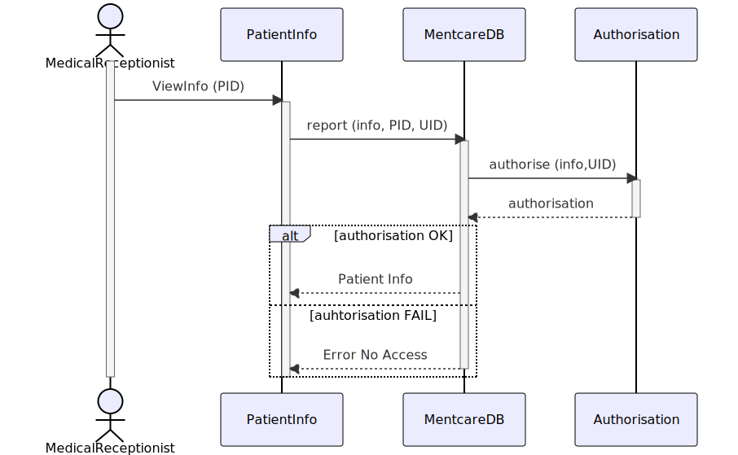

<!-- 
https://mermaid.live/edit#pako:eNp1Uk1PwzAM_StWTkO0fyCHSUUFaYLCBBqnXqzEoxFtUtIUhKb9d9yPbe1Ec3Lynp-fHR-EcpqEFA19tWQVpQY_PFa5BT6ogvOQkTYKy1dSVAfjrGnCGTbfGGiZ8Q8Qr9e3WwyGbNjYvZPwbuini2C13aQ3V8oT5oBMHjqljGOFntI7CZ5q5wOsDGMRsFgEu17x5OVE7RKTNhTOmwY7WxJwvNKYvjtbmRFjTo2nNXGKniphGeYAvDxCfwb8yg1rzgYyXuDSNJVsDNsiXBQfks3Tklo8k7v3nj_x2UGiFDXNqGj1EGhanvUEW_xhEYmKfIVG8xIdurdchIIqyoXkUKP_zEVuj8zjkbi3X6uEDL6lSLS1Zulx4YTcI3cZCS7EbWbDVvbLefwD81fjiQ
-->
---

## Difference between Activity and Sequence Diagrams

Question: What is the difference between Activity and Sequence Diagrams?

- They are both behavioural diagrams but have different emphases.

- **Activity diagram** is representing the control flowing from one activity to another, especially good at the logic of conditional structures, loops, concurrency.

- **Sequence diagram** is representing the sequence of messages flowing from one object to another, how their messages/events are exchanged in what time-order.

> Sequence diagram may also express conditions, loops and concurrency by using **alt** for example, but they are not as intuitive and convenient as those in activity diagram.

---

## Structural models

- **Structural models** of the software display the organization of a system in terms of the components that make up that system and their relationships. 

- Structural models may be **static models**, which show the structure of the system design, or **dynamic models**, which show the organization of the system when it is executing. 

- You create structural models of a system when you are discussing and designing the system architecture. 

---

## Class diagrams

- **Class diagrams** are used when developing an object-oriented system model to show the classes in a system and the associations between these classes. 

- A class can be thought of as a general definition of one kind of system object. 

- An **association** is a link between classes that indicates that there is some relationship between these classes. 

- When you are developing models, objects represent something in the real world, such as a patient, a prescription, a doctor, etc. 

---

## Classes and associations in the MHC-PMS 

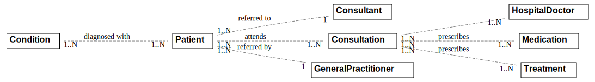

---

## The Consultation class 


---

## Behavioral models

- **Behavioral models** are models of the dynamic behavior of a system as it is executing. They show what happens or what is supposed to happen when a system responds to a stimulus from its environment. 

- You can think of these stimuli as being of two types:
  - **Data** Some data arrives that has to be processed by the system.
  - **Events** Some event happens that triggers system processing. Events may have associated data, although this is not always the case.

---

## Data-driven modeling

- Many business systems are data-processing systems that are primarily driven by data. They are controlled by the data input to the system, with relatively little external event processing. 

- They are particularly useful during the analysis of requirements as they can be used to show end-to-end processing in a system. 

- To show the sequence of processing in a system, we can use two types of diagrams, you can choose which one to use, you do not need both
  - **Activity diagrams** – also called Data Flow Diagrams (DFDs) – highlight the operations or activities
  - **Sequence diagrams** – highlight objects in a system

---

## An activity model of the insulin pump’s operation 

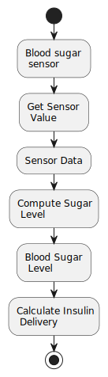
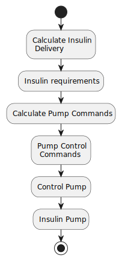

---

## DFDs vs. Sequence diagrams

- Sequence diagrams can be used to model interaction (we have seen that in the previous lecture), but if we draw this so that messages are only sent from left to right, then they show the sequential data processing in the system

- Sequence diagrams highlight objects in the systems, whereas DFDs highlight the operations or activities

- In practice, non-experts seem to find DFD more intuitive, but engineers prefer sequence diagrams

---

## Order Processing Sequence Diagram

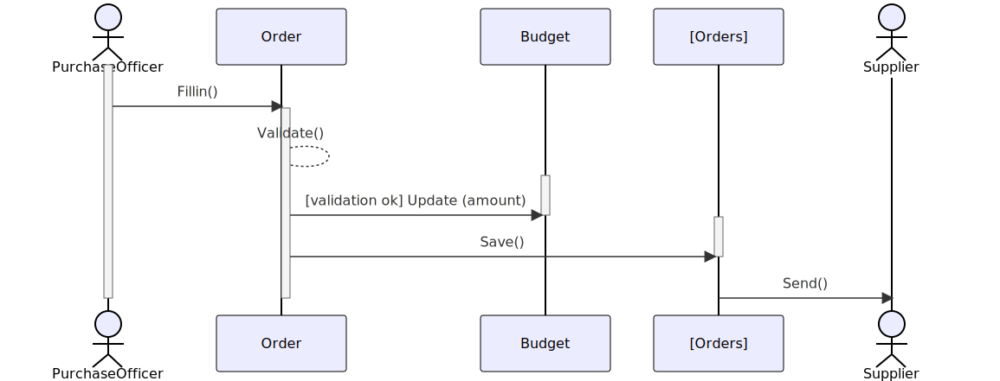

<!--
https://kroki.io/mermaid/svg/eNptkLEOgyAURfd-xRttGn_AgaFputrEtItxIPC0pIgWwe-vQrFoZSDk3vsOcAd8W1QML4I2mrYHmBZlptNws5o96YB5XQuGOjhipAZ3TbdtjJSQU6456gyuQkqhkuMa5EwnuVOaEh9_UCn4FNjmz5Y3aKIBQryUQTn6GdEp6F4V3PsZAAltO6uM53Dcktb40kGHanVBEDMo6BheFJGWoai9wva9FN-vhcDcxuJMNFT8n_ZrJBL3-v4AfASNJg==
-->

---

## Event-driven modelling

- Real-time systems are often event-driven, with minimal data processing. For example, a landline phone switching system responds to events such as ‘receiver off hook’ by generating a dial tone. 

- **Event-driven modelling** shows how a system responds to external and internal events. 

- It assumes that a system has a finite number of states and that events (stimuli) may cause a transition from one state to another

- Event-driven modelling is used extensively when designing and documenting real time systems

---

## State machine models

- UML supports event-driven modelling using state diagrams which are based on state charts.

- State diagrams show system states and events that cause transitions from one state to another.  They do not show the flow of data within the system

- A **state machine** models the behaviour of the system in response to external and internal events.

- State machine models show system states as nodes and events as arcs between these nodes. When an event occurs, the system moves from one state to another.

- **State chart diagram**s are an integral part of the UML and are used to represent state machine models.

---

## State Diagram of Microwave

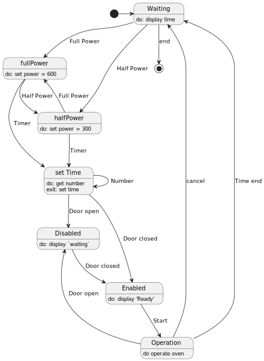

<!-- 
https://www.plantuml.com/plantuml/uml/RL5DQy904BtlhtXuB4WrGWyUYaBRGoaYpR7sC6u65JO9P6Rr8FxtxYQkJT3JBEzZPjxiGfGQzQKpOianNYOJd0w5xetvUVh5-1MvalBKT0NZX6IO8_VMCXTSzDbecsEvhHjDHFPlcztRiWSsYKHod0tG0QEbjRxqBhxVgzhlzdWZfKtrLLUxJeuLbJm22Lp0fi7Qrj3xquk2e2mQq3PTc3jKtP2WN_6fxJuWrqrjMIJYGTBRmLpCTTr1rWywk1HqrWjwkm6UaTEHyStYdTuBqqNCWgiY_jCV
-->

---

## A State Machine Model 

- The problem with state-driven modelling is that the number of possible states increases rapidly

- For large systems, you need to hide details in the models

- To illustrate this, consider the Operation state from the model on the previous slide, and how it can be expanded on the slide below  

---

## Microwave Oven Operation

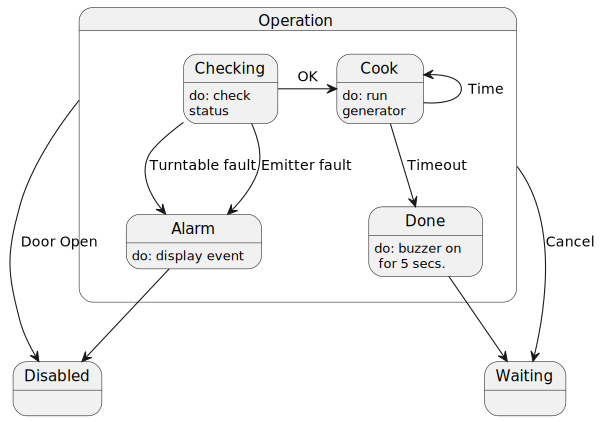

<!--
https://www.plantuml.com/plantuml/uml/RL5DQy904BtlhtXuB4WrGWyUYaBRGoaYpR7sC6u65JO9P6Rr8FxtxYQkJT3JBEzZPjxiGfGQzQKpOianNYOJd0w5xetvUVh5-1MvalBKT0NZX6IO8_VMCXTSzDbecsEvhHjDHFPlcztRiWSsYKHod0tG0QEbjRxqBhxVgzhlzdWZfKtrLLUxJeuLbJm22Lp0fi7Qrj3xquk2e2mQq3PTc3jKtP2WN_6fxJuWrqrjMIJYGTBRmLpCTTr1rWywk1HqrWjwkm6UaTEHyStYdTuBqqNCWgiY_jCV
-->
---

## States and stimuli for the microwave oven (1) 

<table style="font-size: 22px;">
  <thead>
    <tr>
      <th>State</th>
      <th>Description</th>
    </tr>
  </thead>
  <tbody>
    <tr>
      <td>Waiting</td>
      <td>The oven is waiting for input. The display shows the current time.</td>
    </tr>
    <tr>
      <td>Half Power</td>
      <td>The oven power is set to 300 watts. The display shows ‘Half power’.</td>
    </tr>
    <tr>
      <td>Full Power</td>
      <td>The oven power is set to 600 watts. The display shows ‘Full power’.</td>
    </tr>
    <tr>
      <td>Set time</td>
      <td>The cooking time is set to the user’s input value. The display shows the cooking time selected and is updated as the time is set.</td>
    </tr>
    <tr>
      <td>Disabled</td>
      <td>Oven operation is disabled for safety. Interior oven light is on. Display shows ‘Not ready’.</td>
    </tr>
    <tr>
      <td>Enabled</td>
      <td>Oven operation is enabled. Interior oven light is off. Display shows ‘Ready to cook’.</td>
    </tr>
    <tr>
      <td>Operation</td>
      <td>Oven in operation. Interior oven light is on. Display shows the timer countdown. On completion of cooking, the buzzer is sounded for five seconds. Oven light is on. Display shows ‘Cooking complete’ while buzzer is sounding.</td>
    </tr>
  </tbody>
</table>

---

## States and stimuli for the microwave oven (2) 

|State|Description|
|---|---|
|Half Power|The user has pressed the half-power button.|
|Full Power|The user has pressed the full-power button.|
|Time|The user has pressed one of the timer buttons.|
|Number|The user has pressed a numeric key.|
|Door open|The oven door switch is not closed.|
|Door Closed|The oven door switch is closed.|
|Start|The user has pressed the Start button.|
|Cancel|The user has pressed the Cancel button.|

---

## Model-driven engineering (MDE)

- **Model-driven engineering** is an approach to software development where models rather than programs are the principal outputs of the development process. 

- The programs that execute on a hardware/software platform are then generated automatically from the models. 

- Supporters of MDE argue that this raises the level of abstraction in software engineering so that engineers no longer have to be concerned with programming language details or the specifics of execution platforms.

- Questions: 
  - What are the benefits of model-driven engineering? 
  - What are the drawbacks of model-driven engineering? 

---

## Usage of model-driven engineering

- Model-driven engineering is still at an early stage of development, and it is unclear whether it will have a significant effect on software engineering practice. 

- **Pros**
  - Allows systems to be considered at higher levels of abstraction without concern for implementation details
  - Errors are reduced and the design and implementation process is speeded up
  - Generating code automatically means that it is cheaper to adapt systems to new platforms.
- **Cons**
  - Models for abstraction and not necessarily right for implementation.
  - Savings from generating code may be outweighed by the costs of developing translators for new platforms.

---

## Architectural design

- Architectural design is concerned with understanding how a software system should be organised and designing the overall structure of that system.

- Architectural design is the critical link between design and requirements engineering, as it identifies the main structural components in a system and the relationships between them. 

- The output of the architectural design process is an architectural model that describes how the system is organised as a set of communicating components. 

---

## Agility and architecture

- It is generally accepted that an early stage of agile processes is to design an overall systems architecture.

- Refactoring the system architecture is usually expensive because it affects so many components in the system

---

## The architecture of a packing robot control system


---

## Architecture and system characteristics

- **Performance**
  - Localize critical operations and minimize communications. Use large rather than fine-grain components.

- **Security**
  - Use a layered architecture with critical assets in the inner layers.

- **Safety**
  - Localize safety-critical features in a small number of sub-systems.

- **Availability**
  - Include redundant components and mechanisms for fault tolerance.

- **Maintainability**
  - Use fine-grain, replaceable components.

---

## Architectural views


---

## 4+1 view model of software architecture

- A **logical view**, which shows the key abstractions in the system as objects or object classes. 

- A **process view**, which shows how, at run-time, the system is composed of interacting processes. 

- A **development view**, which shows how the software is decomposed for development.

- A **physical view**, which shows the system hardware and how software components are distributed across the processors in the system.

- Related using use cases or scenarios (+1) 
