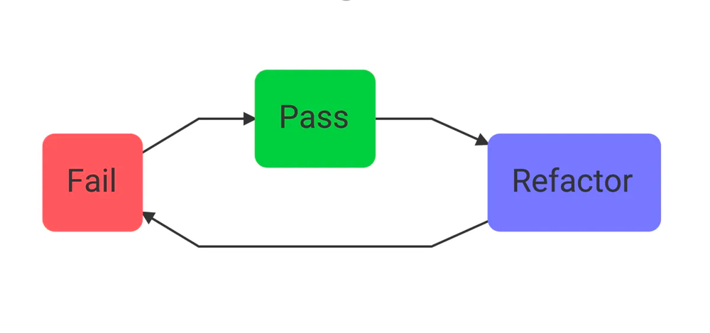
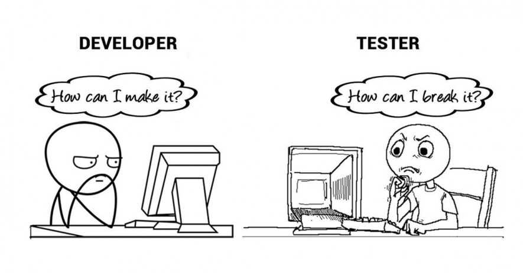
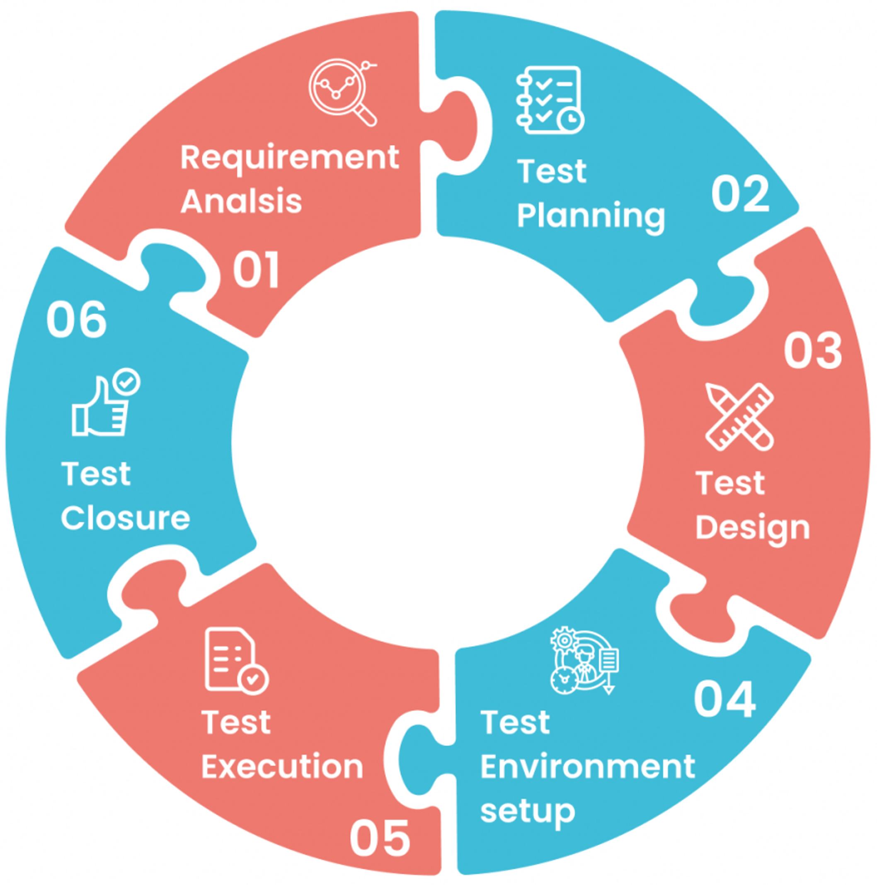

<!--
# Metadata
title: Testing
author: Seb Blair (CompEng0001)
description: Lecture slides on Testing.
keywords: Testing
lang: en

# Slide styling
theme: uog-theme
_class: lead title
paginate: true
_paginate: false
transition: fade 250ms

style: |
  header em { font-style: normal; view-transition-name: header; }
  header strong { font-weight: inherit; view-transition-name: header2; }
  header:not:has(em) { view-transition-name: header; }

  -->

<style scoped>
h1 {
view-transition-name: header;
display: flex;
align-items: center;
margin: 0 auto;
}
</style>

# Testing

<div align=center style="font-size:76px;padding-left:300px;padding-right:300px;" >

```asm
section .data
code           db "ELEE1149", 
name           db "Software Engineering", 
credits        db 15          
module_leader  db "Seb Blair BEng(H) PGCAP MIET MIHEEM FHEA", 
```

</div>

<!-- _footer: "[Download as a PDF](https://github.com/UniOfGreenwich/ELEE1147_Lectures/raw/main/content/Testing/Testing.pdf)" -->

---

<style scoped>
h1 {
view-transition-name: header;
display: flex;
align-items: center;
margin: 0 auto;
}
</style>


<!-- header: "_Testing_" -->


## Why do we Test? 

- Ensures a high quality of code.
- Catches bugs early.
- Ensures we are ‘building the product right’.
<br>
- If tests pass, the behaviour of the program is what you expect.
- If tests fail, then your program is likely not performing as it should.
<br>
- If tests fail then one of two things has happened:
  - Programming errors: You have made an error in the logic of your code (perhaps an out fo bounds error)
  - Understanding errors: You have not understood the requirements, or overlooked definition in the problem 

---

## Types of Testing

<div class="columns-2" style="padding-top:150px">
<div>

[1] Feature Tests 
<br>
[2] Functional Testing
<br>
[3] Performace and Load Testing
<br>
[4] Security Testing 
</div>
<div>

[5] Test Driven Development
<br>
[6] Unit Testing
<br>
[7] User Testing

</div>
</div>

---

## Feature Tests 

<br>
<br>
<br>

- When units become a feature, you may want to write tests to check the functionality of the entire feature to ensure that:
<br>
- The units are interacting with each other 
<br>
- The feature acts as it should

--- 
## Functional Testing

<br>
<br>

- Functional testing is a way of testing all of the ‘moving parts’ of a software product.
<br>
- You should aim to test the entire codebase 
<br>
- For enterprise level systems this could me test suites of thousands of tests.
<br>
- You will be familiar with unit testing which is a type of test that we employ to test the smallest parts (or units) of a program
<br>
- We also use feature tests, system testing and release testing.

---

## Performance and Load Testing

<br>
<br>

- If you are developing an API or system that is going to receive millions of calls per day, the last thing you want is for your software to fail ([Pokémon Go makers call for calm as servers crash across Europe and US](https://www.theguardian.com/technology/2016/jul/16/pokemon-go-server-crash-niantic-europe-us))

<br>

- Many services will have [service level agreements](https://aws.amazon.com/legal/service-level-agreements/) (SLA’s) such as guaranteeing 99.999% uptime 

<br>

- During development you need to ensure that performance will continue as expected and that your system is capable of handling the transactional load required.

--- 

## Security Testing

- Security testing is, as it sounds, testing to find the vulnerabilities in the software product being developed. Pen testing teams will usually be outsourced to test the vulnerabilities in your system.
<br>
- Unhashed passwords
<br>
- Unsanitised text inputs (`“Enter your surname:” DROP TABLE customer_list;`)
<br>
- DDoS attacks
<br>
- HTTP session cookies are visible
<br>
- *Pressing the back button and then ‘show password’*

---

## Test Driven Development

<br>
<br>
<br>

- You should have many test cases for this one method/ function.
<br>
- In fact most code will be written after the test
<br>
- We call this test-driven development (TDD)

---

## Test Driven Development 
<br>
<div class="columns-2">
<div>

- We also use the Red Green Refactor cycle
<br>
  - <span style="color:#FF575E">We write a (failing) test where the test cases will pass when we build the right function </span>
<br>
  - <span style="color:#00CF3E"> We write our code until the test is passing</span>
<br>  
  - <span style="color:#7778FF">We refactor our code </span> 

</div>
<div style="padding-top:150px">



</div>
</div>

---

## TDD vs BDD

- TDD is more developer-centric, revolving around code correctness, with programming language-specific frameworks. 
<br>
- On the other hand, BDD is more user-centric, revolves around system behavior, and promotes collaboration between relevant stakeholders with a domain-specific language. 

<br>

- BDD starts with analyzing the desired behavior that developers want to create. After that, they’ll express the desired behavior using the Gherkin syntax, which consists of **Given** - **When** - **Then** - **And** statements. These statements show developers how to develop the code that fulfills the behaviors described.

---

## BDD

<div class="columns-2" style="padding-top:75px">
<div>

- Gherkin is a plain-text language with a simple structure. 
<br>
- It is designed to be easy to learn by non-programmers
<br>
- Allows concise description of test scenarios and examples to illustrate business rules in most real-world domains.

</div>
<div style="padding-top:75px">

```gherkin
Feature: Account Holder withdraws cash

Scenario: Account has sufficient funds
    Given The account balance is $100
      And the card is valid
      And the machine contains enough money
    When the Account Holder requests $20
    Then the ATM should dispense $20
      And the account balance should be $80
      And the card should be returned
```
</div>
</div>

---

## Unit Testing

<br>
<br>
<br>

- We write unit tests to test units of the program
<br>
- The are usually functions or class methods
<br>
- Unit tests take a function, present it some input and test its output
<br>
- When writing unit tests it is a good idea to use the **Arrange-Action-Assert pattern**

---

## Unit Testing 

<div class="columns-2">
<div style="padding-top:150px">

- Consider the `abs()` function in Python and `Abs()` in C#
<br>
- `abs()`/`Abs()` returns the absolute value of a number (the distance of the number from zero)
<br>
- Using **Arrange-Action-Assert** we can write a test to ensure the behaviour of `abs()`/`Abs()` is what we expect

</div>
<div style="font-size:29px">

```py
# Test abs
def test_abs()

    # Arrange (Setup the testing scenario, mock any data)
    value = 7.5

    # Action (call the function to be tested)
    result = abs(value)

    # Assert (Provide the expected outcome)
    assert result == 7.5
```

```csharp
[TestClass]
public class MathTests
{
    [TestMethod]
    public void TestAbs()
    {
        // Arrange (Setup the testing scenario, mock any data)
        double value = 7.5;

        // Action (call the function to be tested)
        double result = Math.Abs(value);

        // Assert (Provide the expected outcome)
        Assert.AreEqual(7.5, result);
    }
}
```

</div>
</div>

--- 

## User Testing

<br>
<br>

- Usability testing
  - Can users learn to use the system quickly
  - Can the users complete tasks using the system without making errors?
<br>
- Utility testing
  - Can the users do what they need with the system?
<br>
- User interface testing
  - Are the users happy with the interface?

---

## User Testing

<div class="columns-2">
<div>

- Alpha testing	
  - Usually the job of UX Designers
  - Do the users actually want these features?
  - What have you missed?
  - Involve focus groups early on

<br>

- Beta testing
  - Far more users
  - Aware that some bugs may persist, but may be edge cases
  - Windows Release candidates, iOS betas etc.

</div>
<div style="padding-top:150px">



</div>
</div>

---

## System Tests and Release Tests

<div class="columns-2">
<div>

<br>
<br>

- When features make up a product or usable system, you will of course want to test that system and in turn when this becomes a release 

<br>
<br>

- Think about the end of a sprint when you are ready to release your product to your users you will again want to test that the release functions on all platforms/ hardware etc.

</div>
<div style="font-size:16px">

```yml
name: Upload Python Package

on:
  release:
    types: [published]

permissions:
  contents: read

jobs:
  release-build:
    runs-on: ubuntu-latest

    steps:
      - uses: actions/checkout@v4
      - uses: actions/setup-python@v5
        with:
          python-version: "3.10"

      - name: Build release distributions
        run:  python -m pip install build && python -m build

      - name: Upload distributions
        uses: actions/upload-artifact@v4
        with:
          name: release-dists
          path: dist/

  pypi-publish:
    runs-on: ubuntu-latest
    needs:
      - release-build
    permissions:
      id-token: write

    environment:
      name: pypi
      url: https://pypi.org/project/pylings/${{ github.event.release.name }}

    steps:
      - name: Retrieve release distributions
        uses: actions/download-artifact@v4
        with:
          name: release-dists
          path: dist/

      - name: Publish release distributions to PyPI
        uses: pypa/gh-action-pypi-publish@release/v1
        with:
          packages-dir: dist/
```

</div>
</div>

---

## Testing as part of the Pipeline

<div class="columns-2">
<div style="font-size:27px">

- Remember when we said last week that we ran our tests before we deployed our software?
  - What we really mean are our **functional** tests (Unit, Feature, System and Release tests)
<br>
- Things like user testing are undertaken ad-hoc and usually arranged by the Product Manager or Scrum Master
<br>
- In bigger organisations performance and load testing may undertaken by you infrastructure team
<br>
- Security testing should always involve a third party. Either you don’t have the expertise in your organisation or you will be biased and fail to test something important.

</div>
<div>



</div>
</div>
